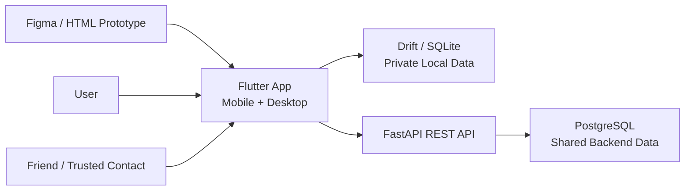
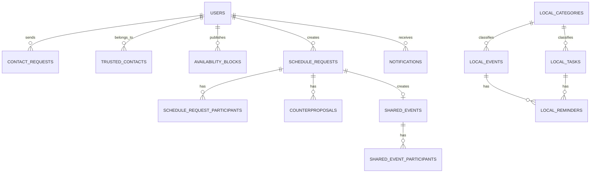
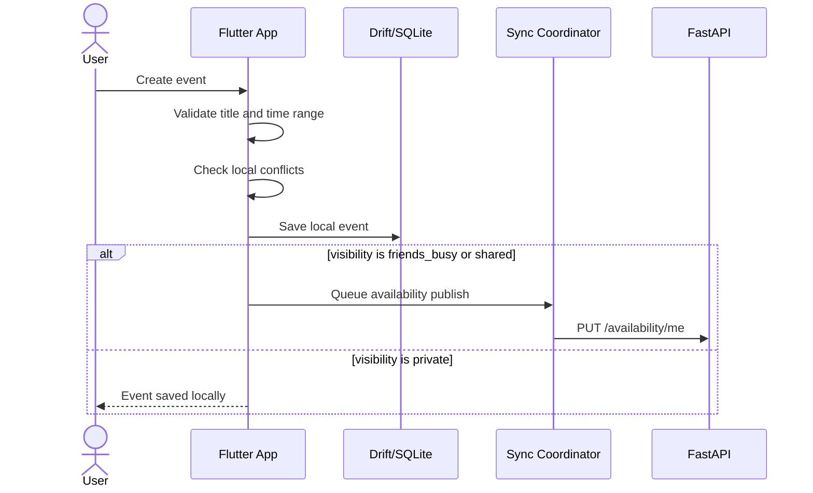
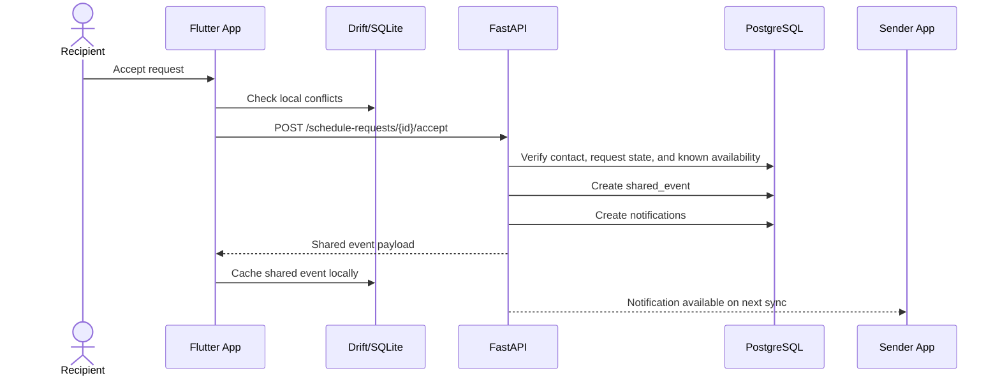
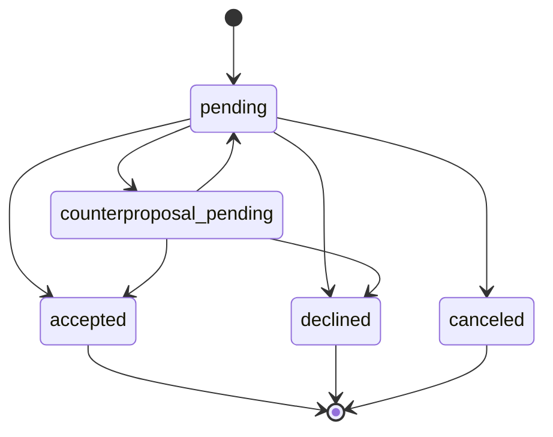
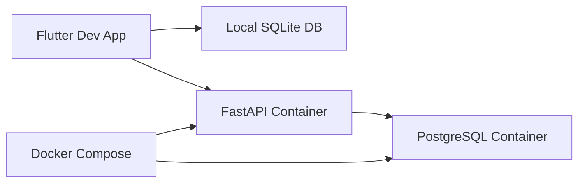

# Blocalm Architecture, API, and Data Model

| Field | Value |
| --- | --- |
| Project | Blocalm |
| Document Type | Architecture / API / Data Model |
| Version | 0.1 |
| Date | 20.05.2026 |
| Prepared by | Project Team |
| Source Basis | `doc/01_Requirements/Blocalm_Requirement_Specification.md`, `doc/03_Project_Plan/Blocalm_Project_Plan.md`, `doc/02_Prototype/README.md` |
| Scope | Blocalm Version 1.0 calendar, planner, reminders, privacy, and trusted scheduling |

Blocalm Version 1.0 is a local-first planning application. The main product value is personal calendar and task planning, with a lightweight backend only for account and trusted scheduling features.

## Change History

| Date | Version | Change | Author(s) |
| --- | --- | --- | --- |
| 20.05.2026 | 0.1 | Initial architecture, API, and data model baseline. | Project Team |

## Table of Contents

1. [Purpose and Scope](#1-purpose-and-scope)
2. [Architectural Goals](#2-architectural-goals)
3. [System Context](#3-system-context)
4. [Application Architecture](#4-application-architecture)
5. [Local-First Data Boundary](#5-local-first-data-boundary)
6. [API Design](#6-api-design)
7. [Data Model](#7-data-model)
8. [Synchronization and Offline Behavior](#8-synchronization-and-offline-behavior)
9. [Security and Privacy](#9-security-and-privacy)
10. [Validation and Business Rules](#10-validation-and-business-rules)
11. [Development and Deployment View](#11-development-and-deployment-view)
12. [Open Decisions](#12-open-decisions)

## 1. Purpose and Scope

This document defines the technical baseline for Blocalm Version 1.0. It explains the planned system architecture, REST API surface, local and backend data models, synchronization boundaries, privacy rules, and development setup.

Version 1.0 includes:

- user registration and login
- personal calendar events, time blocks, recurring events, categories, and reminders
- task creation and task status management
- day, week, month, and year calendar views
- event visibility settings
- trusted contacts and limited availability sharing
- schedule requests with accept, decline, and propose-another-time flows
- shared events created from accepted schedule requests
- in-app notifications
- basic data export and account deletion support where feasible

Version 1.0 excludes journaling, mood tracking, mood statistics, avatar mood representation, and machine-learning-based mood intelligence. Those features remain future-version scope.

## 2. Architectural Goals

| Goal | Architectural Response |
| --- | --- |
| Keep personal planning private by default | Store private events, tasks, categories, reminders, and privacy settings locally in Drift/SQLite. |
| Support offline planning | Allow local calendar and task operations without backend availability. |
| Enable trusted coordination | Use a FastAPI backend and PostgreSQL database for accounts, contacts, availability, schedule requests, shared events, and synchronized notifications. |
| Keep the first implementation manageable | Use a simple layered Flutter client, a focused REST API, and a relational data model. |
| Make development repeatable | Run the FastAPI backend and PostgreSQL database with Docker Compose during development. |
| Preserve traceability to requirements | Keep architecture responsibilities aligned with the SRS functional and non-functional requirements. |

## 3. System Context



The Flutter app is the main product interface. It owns calendar interaction, local planner behavior, local persistence, reminders, privacy controls, and offline states. The backend is intentionally limited to features that require more than one user or secure account state.

## 4. Application Architecture

### 4.1 Client Architecture

The Flutter client should use a layered structure:

| Layer | Responsibility |
| --- | --- |
| Presentation | Screens, navigation, responsive layouts, forms, empty states, and user feedback. |
| State / View Models | UI state, loading/error states, selected calendar period, form state, and optimistic local updates. |
| Domain Services | Conflict checks, recurrence expansion, reminder scheduling, visibility decisions, and schedule request workflow rules. |
| Repositories | Stable interface for events, tasks, categories, contacts, requests, notifications, and settings. |
| Local Persistence | Drift/SQLite tables for private local planning data and local caches. |
| API Client | Typed REST client for backend calls, authentication headers, retries, and error mapping. |
| Sync Coordinator | Publishes limited availability, pulls shared updates, resolves retryable failures, and maintains sync state. |

Suggested package shape:

```text
lib/
  app/
  features/
    auth/
    calendar/
    tasks/
    reminders/
    contacts/
    scheduling/
    notifications/
    settings/
  data/
    local/
    remote/
    repositories/
  domain/
    models/
    services/
  theme/
```

### 4.2 Backend Architecture

The backend should be a FastAPI service with clear module boundaries:

| Module | Responsibility |
| --- | --- |
| Auth | Registration, login, password hashing, token/session issuance, current-user lookup. |
| Users | Profile fields, account deletion, data export metadata. |
| Contacts | Friend requests, trusted contact relationships, contact removal. |
| Availability | Store and retrieve limited free/busy availability blocks. |
| Schedule Requests | Create requests, respond, decline, accept, create counterproposals, track request state. |
| Shared Events | Persist accepted shared events and participant state. |
| Notifications | Create, list, and mark synchronized notifications as read. |
| Database | SQLAlchemy models or equivalent ORM layer, migrations, seed data. |

Suggested backend shape:

```text
backend/
  app/
    main.py
    api/
      routes_auth.py
      routes_users.py
      routes_contacts.py
      routes_availability.py
      routes_schedule_requests.py
      routes_shared_events.py
      routes_notifications.py
    core/
      config.py
      security.py
    models/
    schemas/
    services/
    repositories/
  migrations/
  tests/
```

### 4.3 Responsibility Split

| Capability | Flutter Client | Backend |
| --- | --- | --- |
| Calendar views | Render day/week/month/year from local data and shared cache. | No direct rendering responsibility. |
| Event CRUD | Store local events and shared-event local copies. | Store only shared events and schedule-related event records. |
| Tasks | Store locally. | No V1.0 backend storage unless later approved. |
| Reminders | Schedule and display local in-app reminders. | Store synchronized notifications related to shared features. |
| Conflict checks | Check local events, time blocks, and local shared-event copies. | Check known availability before accepting shared scheduling flows. |
| Friend availability | Display limited free/busy information. | Store and serve limited availability blocks. |
| Authentication | Collect credentials, store auth token securely. | Validate credentials, hash passwords, issue tokens/sessions. |
| Privacy | Enforce visibility before publishing availability or shared data. | Never expose private event details through availability APIs. |

## 5. Local-First Data Boundary

Blocalm separates private local planning data from synchronized shared coordination data.

| Data Type | Default Location | Synchronization Rule |
| --- | --- | --- |
| Private events | Drift/SQLite | Not synchronized. |
| Friends-see-busy events | Drift/SQLite plus limited availability projection | Only start/end busy blocks may be published according to privacy settings. |
| Shared events | PostgreSQL and local cache | Synchronized only for accepted participants. |
| Time blocks | Drift/SQLite | Used locally for planning and conflicts; may publish busy blocks if privacy allows. |
| Tasks | Drift/SQLite | Not synchronized in Version 1.0. |
| Categories | Drift/SQLite | Not synchronized unless later needed for shared visual consistency. |
| Reminders | Drift/SQLite | Local reminders stay local; shared scheduling notifications may be synchronized. |
| Account data | PostgreSQL | Required for login and trusted scheduling. |
| Trusted contacts | PostgreSQL | Required for contact relationships. |
| Schedule requests | PostgreSQL | Required for sender/recipient coordination. |
| Notifications | PostgreSQL and local cache | Shared notifications synchronize; local reminders can remain local. |

Availability publication must use a privacy-safe projection. The backend should receive only fields such as `start_at`, `end_at`, `availability_status`, and optional source metadata. It should not receive private event title, notes, category, or location.

## 6. API Design

### 6.1 API Principles

- Base path: `/api/v1`
- Format: JSON over HTTP
- Time format: ISO 8601 timestamps with timezone or UTC-normalized values
- Authentication: bearer token or secure session token after login
- IDs: UUID strings
- Pagination: list endpoints should accept `limit` and `cursor` once list sizes require it
- Errors: return consistent error objects with `code`, `message`, and optional `field_errors`
- Idempotency: state-changing schedule request actions should be safe against accidental duplicate submissions where practical

Example error:

```json
{
  "code": "validation_error",
  "message": "The event end time must be after the start time.",
  "field_errors": {
    "end_at": "Must be after start_at."
  }
}
```

### 6.2 Authentication and Users

| Method | Endpoint | Purpose | Request Body | Response |
| --- | --- | --- | --- | --- |
| `POST` | `/api/v1/auth/register` | Create user account. | `email`, `password`, optional `display_name`, `timezone` | User summary and auth token/session. |
| `POST` | `/api/v1/auth/login` | Authenticate existing user. | `email`, `password` | User summary and auth token/session. |
| `POST` | `/api/v1/auth/logout` | Revoke current token/session. | None or refresh token | Success status. |
| `GET` | `/api/v1/users/me` | Load current user profile. | None | User profile. |
| `PATCH` | `/api/v1/users/me` | Update profile fields. | `display_name`, `timezone` | Updated user profile. |
| `DELETE` | `/api/v1/users/me` | Request account deletion. | Confirmation flag | Deletion status. |
| `GET` | `/api/v1/users/me/export` | Export account/shared data. | None | Export payload or export job metadata. |

### 6.3 Trusted Contacts

| Method | Endpoint | Purpose | Request Body / Query | Response |
| --- | --- | --- | --- | --- |
| `GET` | `/api/v1/contacts` | List trusted contacts. | Optional search/status query | Contact summaries. |
| `POST` | `/api/v1/contact-requests` | Send a contact request. | `recipient_email` or `recipient_user_id`, optional `message` | Contact request. |
| `GET` | `/api/v1/contact-requests` | List incoming/outgoing requests. | Optional `direction`, `status` | Request list. |
| `POST` | `/api/v1/contact-requests/{request_id}/accept` | Accept a contact request. | None | Trusted contact record. |
| `POST` | `/api/v1/contact-requests/{request_id}/decline` | Decline a contact request. | Optional reason | Updated request. |
| `DELETE` | `/api/v1/contacts/{contact_id}` | Remove a trusted contact. | None | Success status. |

### 6.4 Availability

| Method | Endpoint | Purpose | Request Body / Query | Response |
| --- | --- | --- | --- | --- |
| `PUT` | `/api/v1/availability/me` | Replace the user's published availability for a time window. | `window_start`, `window_end`, `blocks[]` | Published block summary. |
| `GET` | `/api/v1/availability` | Read trusted contacts' limited availability. | `user_ids`, `from`, `to` | Availability blocks by user. |
| `DELETE` | `/api/v1/availability/me` | Clear published availability in a time window. | `from`, `to` | Success status. |

Availability block payload:

```json
{
  "start_at": "2026-05-22T13:00:00Z",
  "end_at": "2026-05-22T14:00:00Z",
  "status": "busy"
}
```

### 6.5 Schedule Requests

| Method | Endpoint | Purpose | Request Body / Query | Response |
| --- | --- | --- | --- | --- |
| `GET` | `/api/v1/schedule-requests` | List sent and received requests. | Optional `direction`, `status`, `from`, `to` | Request list. |
| `POST` | `/api/v1/schedule-requests` | Create a schedule request. | `title`, `start_at`, `end_at`, `recipient_ids`, optional `message` | Created request. |
| `GET` | `/api/v1/schedule-requests/{request_id}` | Load request details. | None | Request with participants and proposals. |
| `POST` | `/api/v1/schedule-requests/{request_id}/accept` | Accept the current proposal. | Optional participant note | Updated request and shared event. |
| `POST` | `/api/v1/schedule-requests/{request_id}/decline` | Decline the request. | Optional reason | Updated request. |
| `POST` | `/api/v1/schedule-requests/{request_id}/counterproposals` | Propose another time. | `start_at`, `end_at`, optional `message` | Counterproposal and updated request. |
| `POST` | `/api/v1/schedule-requests/{request_id}/cancel` | Cancel a sent pending request. | Optional reason | Updated request. |

Request status values:

| Status | Meaning |
| --- | --- |
| `pending` | Waiting for recipient response. |
| `accepted` | Accepted and converted into a shared event. |
| `declined` | Declined by the recipient. |
| `counterproposal_pending` | A different time has been proposed. |
| `canceled` | Canceled by the requester before completion. |

### 6.6 Shared Events

| Method | Endpoint | Purpose | Request Body / Query | Response |
| --- | --- | --- | --- | --- |
| `GET` | `/api/v1/shared-events` | List shared events for current user. | `from`, `to` | Shared event list. |
| `GET` | `/api/v1/shared-events/{event_id}` | Load shared event details. | None | Shared event. |
| `PATCH` | `/api/v1/shared-events/{event_id}` | Update shared event fields where allowed. | `title`, `start_at`, `end_at`, optional `location`, `notes` | Updated shared event. |
| `DELETE` | `/api/v1/shared-events/{event_id}` | Cancel or leave shared event. | Optional reason | Updated status. |

Only participants should be able to read shared event details. Private local events are never available through this API.

### 6.7 Notifications

| Method | Endpoint | Purpose | Request Body / Query | Response |
| --- | --- | --- | --- | --- |
| `GET` | `/api/v1/notifications` | List synchronized notifications. | Optional `unread_only`, `limit`, `cursor` | Notification list. |
| `POST` | `/api/v1/notifications/{notification_id}/read` | Mark one notification as read. | None | Updated notification. |
| `POST` | `/api/v1/notifications/read-all` | Mark all visible notifications as read. | Optional `before` timestamp | Success status. |

Notification types:

- `schedule_request_received`
- `schedule_request_accepted`
- `schedule_request_declined`
- `counterproposal_received`
- `shared_event_created`
- `shared_event_changed`

Local reminder notifications may be stored only in SQLite and do not need backend records.

## 7. Data Model

### 7.1 Conceptual Entity Overview



Backend entities are shown in uppercase. Local entities are prefixed with `LOCAL_` because they live in Drift/SQLite.

### 7.2 Local Drift/SQLite Tables

#### `local_events`

Stores private events, time blocks, and local copies of shared events.

| Field | Type | Notes |
| --- | --- | --- |
| `id` | UUID/text | Local primary key. |
| `owner_user_id` | UUID/text nullable | Backend user ID when signed in. |
| `item_type` | text enum | `event` or `time_block`. |
| `title` | text | Required. |
| `start_at` | datetime | Required. |
| `end_at` | datetime | Required and after `start_at`. |
| `all_day` | boolean | Default false. |
| `category_id` | UUID/text nullable | References `local_categories.id`. |
| `visibility` | text enum | `private`, `friends_busy`, or `shared`. |
| `recurrence_rule` | text nullable | Suggested RRULE string for recurring items. |
| `recurrence_parent_id` | UUID/text nullable | Links edited occurrences to a series. |
| `reminder_offset_minutes` | integer nullable | Example: 15, 30, 60, 1440. |
| `location` | text nullable | Private unless shared. |
| `notes` | text nullable | Private unless shared. |
| `source` | text enum | `local` or `shared`. |
| `shared_event_id` | UUID/text nullable | Backend shared event ID for synchronized copies. |
| `sync_state` | text enum | `local_only`, `synced`, `pending_upload`, `sync_error`. |
| `created_at` | datetime | Local creation timestamp. |
| `updated_at` | datetime | Last local update. |
| `deleted_at` | datetime nullable | Soft delete for sync-safe removal. |

#### `local_tasks`

Stores local private tasks.

| Field | Type | Notes |
| --- | --- | --- |
| `id` | UUID/text | Primary key. |
| `owner_user_id` | UUID/text nullable | Backend user ID when signed in. |
| `title` | text | Required. |
| `notes` | text nullable | Optional private notes. |
| `due_at` | datetime nullable | Optional due date/time. |
| `category_id` | UUID/text nullable | References `local_categories.id`. |
| `priority` | text enum | `low`, `normal`, `high`. |
| `status` | text enum | `open`, `in_progress`, `done`. |
| `recurrence_rule` | text nullable | Optional future support. |
| `reminder_offset_minutes` | integer nullable | Optional reminder setting. |
| `completed_at` | datetime nullable | Set when status becomes `done`. |
| `created_at` | datetime | Local creation timestamp. |
| `updated_at` | datetime | Last local update. |
| `deleted_at` | datetime nullable | Soft delete. |

#### `local_categories`

Stores default and custom category definitions.

| Field | Type | Notes |
| --- | --- | --- |
| `id` | UUID/text | Primary key. |
| `name` | text | Example: Work, Personal, Health, Social, Study. |
| `color` | text | Hex color token or theme token. |
| `is_default` | boolean | True for seeded categories. |
| `sort_order` | integer | Display order. |
| `created_at` | datetime | Created timestamp. |
| `updated_at` | datetime | Updated timestamp. |

#### `local_reminders`

Stores local reminder triggers for events and tasks.

| Field | Type | Notes |
| --- | --- | --- |
| `id` | UUID/text | Primary key. |
| `owner_type` | text enum | `event` or `task`. |
| `owner_id` | UUID/text | References local event or task. |
| `trigger_at` | datetime | Calculated reminder time. |
| `offset_minutes` | integer | Stored user selection. |
| `status` | text enum | `scheduled`, `shown`, `dismissed`, `canceled`. |
| `created_at` | datetime | Created timestamp. |

#### `local_privacy_settings`

Stores local privacy defaults.

| Field | Type | Notes |
| --- | --- | --- |
| `id` | UUID/text | Primary key. |
| `owner_user_id` | UUID/text nullable | Backend user ID when signed in. |
| `default_event_visibility` | text enum | Default `private`. |
| `share_busy_by_default` | boolean | Controls availability publication. |
| `availability_window_days` | integer | How far ahead to publish free/busy blocks. |
| `updated_at` | datetime | Last update. |

#### `local_notification_cache`

Stores local copies of synchronized notifications and optional local reminder notification history.

| Field | Type | Notes |
| --- | --- | --- |
| `id` | UUID/text | Local primary key. |
| `backend_notification_id` | UUID/text nullable | Present for synchronized notifications. |
| `type` | text enum | Reminder or shared scheduling notification type. |
| `title` | text | Display title. |
| `body` | text nullable | Display body. |
| `related_entity_type` | text nullable | Example: `schedule_request`, `shared_event`, `local_event`. |
| `related_entity_id` | UUID/text nullable | Related ID. |
| `read_at` | datetime nullable | Null means unread. |
| `created_at` | datetime | Created timestamp. |

#### `local_sync_outbox`

Stores retryable sync actions.

| Field | Type | Notes |
| --- | --- | --- |
| `id` | UUID/text | Primary key. |
| `operation_type` | text enum | `publish_availability`, `accept_request`, `decline_request`, `mark_notification_read`, etc. |
| `entity_type` | text | Entity affected by the operation. |
| `entity_id` | UUID/text nullable | Local or backend entity ID. |
| `payload_json` | text/json | Request payload. |
| `status` | text enum | `pending`, `running`, `completed`, `failed`. |
| `retry_count` | integer | Retry attempts. |
| `last_error` | text nullable | Last failure message. |
| `created_at` | datetime | Created timestamp. |
| `updated_at` | datetime | Updated timestamp. |

### 7.3 Backend PostgreSQL Tables

#### `users`

| Field | Type | Notes |
| --- | --- | --- |
| `id` | UUID | Primary key. |
| `email` | varchar unique | Login identifier. |
| `password_hash` | varchar | Secure password hash only. |
| `display_name` | varchar nullable | User-facing name. |
| `timezone` | varchar | Example: `Europe/Berlin`. |
| `created_at` | timestamptz | Created timestamp. |
| `updated_at` | timestamptz | Updated timestamp. |
| `deleted_at` | timestamptz nullable | Soft delete marker. |

#### `auth_sessions`

| Field | Type | Notes |
| --- | --- | --- |
| `id` | UUID | Primary key. |
| `user_id` | UUID | References `users.id`. |
| `token_hash` | varchar | Hash of session or refresh token. |
| `expires_at` | timestamptz | Expiration time. |
| `revoked_at` | timestamptz nullable | Set on logout/revocation. |
| `created_at` | timestamptz | Created timestamp. |

#### `contact_requests`

| Field | Type | Notes |
| --- | --- | --- |
| `id` | UUID | Primary key. |
| `requester_id` | UUID | User who sent the request. |
| `recipient_id` | UUID | User who receives the request. |
| `status` | text enum | `pending`, `accepted`, `declined`, `canceled`. |
| `message` | text nullable | Optional request note. |
| `created_at` | timestamptz | Created timestamp. |
| `responded_at` | timestamptz nullable | Response timestamp. |

#### `trusted_contacts`

| Field | Type | Notes |
| --- | --- | --- |
| `id` | UUID | Primary key. |
| `user_a_id` | UUID | One side of relationship. |
| `user_b_id` | UUID | Other side of relationship. |
| `created_from_request_id` | UUID nullable | Original contact request. |
| `created_at` | timestamptz | Created timestamp. |

The pair `(user_a_id, user_b_id)` should be unique regardless of ordering.

#### `availability_blocks`

| Field | Type | Notes |
| --- | --- | --- |
| `id` | UUID | Primary key. |
| `user_id` | UUID | Owner of the published block. |
| `start_at` | timestamptz | Busy block start. |
| `end_at` | timestamptz | Busy block end. |
| `status` | text enum | `busy` for V1.0. |
| `source_hash` | varchar nullable | Optional privacy-safe hash for replacement/deduplication. |
| `created_at` | timestamptz | Created timestamp. |
| `updated_at` | timestamptz | Updated timestamp. |

No title, category, notes, or location fields are stored here.

#### `schedule_requests`

| Field | Type | Notes |
| --- | --- | --- |
| `id` | UUID | Primary key. |
| `requester_id` | UUID | User who created the request. |
| `title` | varchar | Request title. |
| `message` | text nullable | Optional sender note. |
| `start_at` | timestamptz | Current proposed start. |
| `end_at` | timestamptz | Current proposed end. |
| `status` | text enum | `pending`, `accepted`, `declined`, `counterproposal_pending`, `canceled`. |
| `current_counterproposal_id` | UUID nullable | Active counterproposal, if any. |
| `shared_event_id` | UUID nullable | Created after acceptance. |
| `created_at` | timestamptz | Created timestamp. |
| `updated_at` | timestamptz | Updated timestamp. |

#### `schedule_request_participants`

| Field | Type | Notes |
| --- | --- | --- |
| `id` | UUID | Primary key. |
| `schedule_request_id` | UUID | References `schedule_requests.id`. |
| `user_id` | UUID | Recipient or requester. |
| `role` | text enum | `requester`, `recipient`. |
| `response_status` | text enum | `pending`, `accepted`, `declined`, `countered`. |
| `responded_at` | timestamptz nullable | Last response time. |

This table allows direct requests in V1.0 and can support group events later.

#### `counterproposals`

| Field | Type | Notes |
| --- | --- | --- |
| `id` | UUID | Primary key. |
| `schedule_request_id` | UUID | Parent request. |
| `proposer_id` | UUID | User who proposed the alternative. |
| `start_at` | timestamptz | Proposed start. |
| `end_at` | timestamptz | Proposed end. |
| `message` | text nullable | Optional explanation. |
| `status` | text enum | `pending`, `accepted`, `declined`, `withdrawn`. |
| `created_at` | timestamptz | Created timestamp. |

#### `shared_events`

| Field | Type | Notes |
| --- | --- | --- |
| `id` | UUID | Primary key. |
| `organizer_id` | UUID | User who owns organizer actions. |
| `source_schedule_request_id` | UUID nullable | Request that created the event. |
| `title` | varchar | Shared event title visible to participants. |
| `start_at` | timestamptz | Event start. |
| `end_at` | timestamptz | Event end. |
| `location` | text nullable | Shared only with participants. |
| `notes` | text nullable | Shared only with participants. |
| `status` | text enum | `active`, `canceled`. |
| `created_at` | timestamptz | Created timestamp. |
| `updated_at` | timestamptz | Updated timestamp. |

#### `shared_event_participants`

| Field | Type | Notes |
| --- | --- | --- |
| `id` | UUID | Primary key. |
| `shared_event_id` | UUID | References `shared_events.id`. |
| `user_id` | UUID | Participant user. |
| `participation_status` | text enum | `accepted`, `declined`, `removed`. |
| `last_synced_at` | timestamptz nullable | Last client sync acknowledgement. |

#### `notifications`

| Field | Type | Notes |
| --- | --- | --- |
| `id` | UUID | Primary key. |
| `user_id` | UUID | Recipient. |
| `type` | text enum | Shared scheduling notification type. |
| `title` | varchar | Display title. |
| `body` | text nullable | Display body. |
| `related_entity_type` | text nullable | Example: `schedule_request`, `shared_event`. |
| `related_entity_id` | UUID nullable | Related backend ID. |
| `read_at` | timestamptz nullable | Null means unread. |
| `created_at` | timestamptz | Created timestamp. |

### 7.4 Shared Enums

| Enum | Values |
| --- | --- |
| `EventVisibility` | `private`, `friends_busy`, `shared` |
| `LocalEventType` | `event`, `time_block` |
| `TaskStatus` | `open`, `in_progress`, `done` |
| `TaskPriority` | `low`, `normal`, `high` |
| `ScheduleRequestStatus` | `pending`, `accepted`, `declined`, `counterproposal_pending`, `canceled` |
| `ParticipantResponseStatus` | `pending`, `accepted`, `declined`, `countered` |
| `NotificationReadState` | derived from `read_at` null/not-null |

## 8. Synchronization and Offline Behavior

### 8.1 Local Event Creation Flow



Private events stay local. Events marked `friends_busy` may publish only limited busy blocks. Events marked `shared` should be created through schedule request or shared event flows so all participants receive consistent records.

### 8.2 Schedule Request Acceptance Flow



### 8.3 Retry Rules

| Situation | Expected Behavior |
| --- | --- |
| Backend unavailable during local event creation | Save locally; show shared features as unavailable or pending. |
| Availability publish fails | Keep local event saved; queue retry in `local_sync_outbox`. |
| Schedule request action fails | Keep request in previous state and show clear error. Retry only if the operation is safe. |
| Notification read sync fails | Mark locally as read if desired, queue backend update retry. |
| Local conflict detected | Warn before saving; block save when the selected conflict policy disallows overlap. |

## 9. Security and Privacy

| Area | Rule |
| --- | --- |
| Passwords | Store only secure password hashes in PostgreSQL. Never store plain text passwords. |
| Authentication | Require authentication for all contact, availability, schedule request, shared event, notification, export, and deletion endpoints. |
| Authorization | Users may access only their own account, their trusted contact relationships, and shared entities where they are participants. |
| Private events | Never send private event title, notes, category, or location to the backend. |
| Availability | Publish only privacy-safe busy blocks according to user settings. |
| Shared events | Show shared details only to accepted participants. |
| Account deletion | Remove local personal data and remove or anonymize backend data according to documented privacy rules. |
| Development data | Use seed data for testing; avoid storing real private data in development databases. |

If the backend is later hosted outside a local development environment, HTTPS must be required for all API traffic.

## 10. Validation and Business Rules

| Rule | Applies To | Enforcement Location |
| --- | --- | --- |
| Title is required | Events, time blocks, tasks, schedule requests | Client form validation and backend where synchronized. |
| `end_at` must be after `start_at` | Events, time blocks, schedule requests, shared events | Client and backend. |
| Private event details are owner-only | Events | Client sync logic and backend API design. |
| Tasks remain local in V1.0 | Tasks | Client repository and sync coordinator. |
| Friend connection requires acceptance | Trusted contacts | Backend. |
| Schedule request recipient must be trusted contact | Schedule requests | Backend. |
| Accepted request creates shared event | Schedule requests | Backend service transaction. |
| Request state transitions must be valid | Schedule requests | Backend. |
| Reminder trigger time must be derived from event/task time | Reminders | Client domain service. |
| Double-booking checks include events and time blocks | Calendar items | Client; backend checks known availability for shared acceptance. |

Recommended valid request transitions:



## 11. Development and Deployment View

### 11.1 Local Development

The planned local setup is:



Expected developer commands once source code exists:

```text
flutter pub get
flutter run
docker compose up --build
```

The exact commands may change after the implementation repository structure is created.

### 11.2 Configuration

Backend configuration should use documented environment variables:

| Variable | Purpose |
| --- | --- |
| `DATABASE_URL` | PostgreSQL connection string. |
| `AUTH_SECRET` | Token signing or session secret. |
| `ACCESS_TOKEN_TTL_MINUTES` | Access token lifetime if token auth is used. |
| `CORS_ALLOWED_ORIGINS` | Allowed local development origins. |
| `ENVIRONMENT` | `development`, `test`, or `production`. |

Client configuration should include:

| Setting | Purpose |
| --- | --- |
| API base URL | Points to local FastAPI server during development. |
| Sync enabled flag | Allows local-only testing if backend is unavailable. |
| Availability publish window | Defines how many days of busy blocks are published. |

## 12. Open Decisions

| Decision | Current Recommendation |
| --- | --- |
| Exact Flutter state management library | Choose after implementation starts; keep repositories and domain services independent of UI state library. |
| Auth mechanism | Use bearer access tokens with secure refresh/session handling, or opaque server sessions. Decide before backend implementation. |
| Recurrence format | Use an RRULE-compatible string where practical. |
| Conflict policy | Warn by default; prevent conflicts only when user settings or shared acceptance rules require it. |
| Push notifications | Use in-app notifications for V1.0; platform push or email notifications are optional later additions. |
| Group events | Data model supports multiple participants, but direct one-to-one schedule requests should be implemented first. |
| Account deletion details | Define exact delete vs anonymize behavior before handling real user data. |

