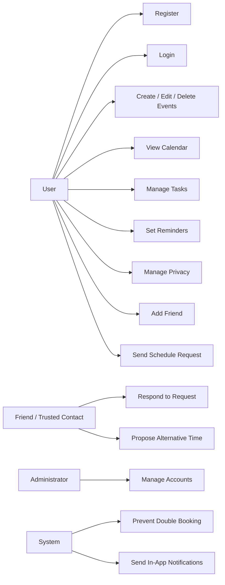

# Blocalm

## Software Requirements Specification

[Document structure based on the RUP-style "Requirements Specification" reference document]

| Field | Value |
| --- | --- |
| Project | Blocalm |
| Document Type | Software Requirements Specification (SRS) |
| Version | 0.2 |
| Source Basis | Original Planora requirements plan content |
| Format Reference | RUP-style requirements specification template |
| Date | 01.05.2026 |
| Prepared by | Project Team |

Blocalm helps users plan their time, structure daily routines, and coordinate trusted availability while keeping personal data private by default.

## Change History

| Date | Version | Change | Author(s) |
| --- | --- | --- | --- |
| 01.05.2026 | 0.1 | Initial creation of the Software Requirements Plan for Blocalm. | Project Team |
| 20.05.2026 | 0.2 | Rewritten as a Markdown Software Requirements Specification using the provided requirements specification format as reference. | Project Team |

## Table of Contents

1. [Introduction](#1-introduction)
2. [Overall Description](#2-overall-description)
3. [Use Case Survey](#3-use-case-survey)
4. [Specific Requirements](#4-specific-requirements)
5. [Use Cases](#5-use-cases)
6. [Traceability](#6-traceability)
7. [Future Version Scope](#7-future-version-scope)
8. [Planned Deliverables](#8-planned-deliverables)
9. [Conclusion](#9-conclusion)

## 1. Introduction

The introduction defines the purpose, scope, terms, references, and structure of the requirements specification. It establishes a common foundation for the project team before implementation begins.

### 1.1 Purpose

Blocalm is the official product name used throughout this specification.

The purpose of this Software Requirements Specification is to define the functional and non-functional requirements for Blocalm Version 1.0. The document converts the existing requirements plan into a more implementation-ready specification.

Blocalm is planned as a local-first personal productivity and scheduling application. The first version focuses on calendar and planner functionality. Future versions may include journaling, mood tracking, visual mood summaries, and machine-learning-based mood pattern analysis.

This SRS supports requirement review, implementation planning, testing, and traceability. Each requirement is written so that it can be reviewed, implemented, and verified through a related use case or test case.

### 1.2 Scope

This specification covers Blocalm Version 1.0. The first implemented version focuses on personal scheduling and trusted coordination between users.

Version 1.0 includes:

- personal calendar management
- planner and task management
- time blocking and recurring routines
- event reminders and in-app notifications
- friend connections and shared availability
- schedule requests with accept, reject, and propose-another-time options
- basic privacy settings and local-first data handling
- user registration, login, and basic account management
- lightweight backend support for shared features

The following features are future extensions and are not part of the detailed Version 1.0 implementation scope:

- journal entries and guided journal prompts
- photo and voice-note journal attachments
- mood tracking and mood statistics
- color-wheel mood visualization
- avatar-based mood representation
- machine-learning-based mood pattern detection

### 1.3 Definitions, Acronyms, and Abbreviations

| Term | Description |
| --- | --- |
| API | Application Programming Interface |
| Backend | Server-side logic that handles shared features, user accounts, requests, and synchronization |
| Dart | Programming language used by Flutter applications |
| DB | Database |
| Docker Compose | Tool used to run backend services and databases together in a repeatable local development environment |
| Drift | Flutter/Dart persistence library used with SQLite for local app data |
| FastAPI | Python web framework planned for the backend REST API |
| Figma | Design and prototyping tool used for UI design, user-flow exploration, and developer handoff |
| Flutter | Cross-platform UI framework used to build mobile, desktop, and web applications from a shared codebase |
| GDPR | General Data Protection Regulation |
| GUI | Graphical User Interface |
| Local-first | Architecture in which personal data is stored locally by default and synchronized only when necessary |
| MVP | Minimum Viable Product |
| PostgreSQL | Relational database planned for backend/shared data |
| REST | Representational State Transfer |
| Server | Environment where the backend service runs |
| SQLite | Local relational database used on the app client for private planning data |
| SRP | Software Requirements Plan |
| SRS | Software Requirements Specification |

### 1.4 References

- Provided project template: RUP-style requirements specification format.
- Source basis: original Planora requirements plan content.
- UI prototype: `doc/02_Prototype/Blocalm_dashboard.html`.
- Internal project discussion and agreed project scope for Blocalm.
- Planned technologies: Figma for design/prototyping, Flutter and Dart for the cross-platform frontend, Drift/SQLite for private local app storage, FastAPI for the backend REST API, PostgreSQL for backend/shared data, and Docker Compose for local backend development.

### 1.5 Overview

The remaining sections describe the product overview, stakeholders, use cases, functional requirements, non-functional requirements, traceability, future version scope, and planned deliverables.

## 2. Overall Description

The overall description analyzes the software context by presenting the product perspective, product functions, user groups, assumptions, dependencies, and constraints.

### 2.1 Product Perspective

Blocalm is a personal productivity and reflection platform that helps users plan their time, manage daily routines, coordinate availability with trusted people, and later understand emotional patterns through journaling and mood tracking.

Blocalm Version 1.0 will be developed as a cross-platform application using Flutter as the preferred frontend framework. The same frontend codebase should support mobile and desktop targets where practical. Figma will be used for UI design, prototyping, and developer handoff, while the production frontend will be implemented in Flutter rather than directly in Figma.

The system follows a local-first approach. Personal calendar and task data should be stored locally on the user's device using Drift/SQLite. Features that involve other users, such as account login, friend connections, shared availability, schedule requests, shared events, and synchronized notifications, require a lightweight backend service.

The backend should be implemented as a FastAPI REST API with PostgreSQL as the backend/shared database. During development, Docker Compose should run the FastAPI service and PostgreSQL database together so all developers can start the same backend environment consistently. No paid server is required for the first development phase.

Conceptual architecture:

```text
Figma Design Prototype -> Flutter App -> REST API -> FastAPI Backend -> PostgreSQL
                              |
                              +-> Drift/SQLite Local Storage
```

The Flutter app handles the user interface, local interaction, private planning data, reminders, and offline behavior across supported mobile and desktop platforms. The backend handles shared functions such as account authentication, friend connections, shared availability, schedule requests, shared events, and notification synchronization.

### 2.2 Product Functions and Goals

The main goal of Blocalm is to help users organize personal time clearly and coordinate schedules with trusted people without losing control over privacy.

The application should support users in:

- planning days, weeks, months, and years
- creating events, tasks, routines, and time blocks
- receiving reminders before events and tasks
- managing event visibility for private, friends, and shared contexts
- connecting with trusted contacts
- sending and responding to schedule requests
- avoiding double bookings through system checks
- keeping personal data local whenever shared synchronization is not required

### 2.3 Target Users

The main target users are general users, especially:

- students
- working people
- young adults
- users who want a personal planning system
- users who occasionally coordinate time with trusted friends or group members

The application is mainly designed for individual use. Social scheduling is included as a supporting function, not as the main identity of the app.

### 2.4 Stakeholders and Actors

| Stakeholder | Interest |
| --- | --- |
| Project Team | Wants to develop a realistic and working software project. |
| Student Developers | Need a manageable technical scope using accessible tools. |
| End Users | Want an easy-to-use, aesthetic, and reliable planner. |
| Friends / Trusted Contacts | Want to request shared time slots without seeing private details. |
| Future Users | May later use journaling and mood-tracking features. |
| Administrator | Manages user accounts and system-level data if required. |

| Actor | Description |
| --- | --- |
| User | Main user of the app who creates events, tasks, routines, and time blocks. |
| Friend / Trusted Contact | Connected user who can view limited availability and send schedule requests. |
| Administrator | Optional actor who manages accounts and system-level information. |
| System | Handles reminders, notifications, synchronization, and double-booking checks. |

### 2.5 Assumptions

- Users have basic computer or mobile skills and can operate a modern calendar/planner application.
- The first version is developed for a small group of approximately 5 users.
- Users have internet access for social scheduling features.
- Personal calendar and task data can be stored locally.
- Shared features require backend synchronization.
- The project team will use free or open-source tools where possible.

### 2.6 Dependencies

- Supported mobile and desktop operating systems are required for the selected Flutter targets.
- The Flutter SDK and Dart toolchain are required to build the frontend application.
- Drift/SQLite or an equivalent local storage layer is required for private local calendar and task data.
- A FastAPI backend service is required for account handling, friend connections, shared availability, schedule requests, shared events, and synchronized notifications.
- PostgreSQL is required for backend/shared data during development.
- Reliable network connectivity is required for social scheduling features.
- Docker Compose should be used to run backend and database services in a repeatable development environment.

### 2.7 Constraints

- Version 1.0 shall be planned as a cross-platform application with mobile and desktop support.
- Flutter is the preferred frontend framework for Version 1.0.
- Figma shall be used for design, prototyping, and handoff, not as the production frontend.
- The backend should use FastAPI and expose a REST API or equivalent lightweight API.
- Backend/shared data should be stored in PostgreSQL during development.
- The backend API and PostgreSQL database should run through Docker Compose during development.
- Private calendar and task data should be stored locally through Drift/SQLite or an equivalent local app database.
- Version 1.0 shall focus on calendar and planner functionality only.
- Journaling and mood tracking are not part of the Version 1.0 implementation.
- The project shall avoid paid hosting during the early development phase.
- Version 1.0 shall support English only.
- The system shall keep private calendar data local unless synchronization is explicitly needed for shared features.

## 3. Use Case Survey

The following overview summarizes the planned Version 1.0 use cases.

| Use Case ID | Use Case Name | Description | Actors |
| --- | --- | --- | --- |
| UC-V1-001 | Perform User Registration | A user creates a Blocalm account using required account information. | User |
| UC-V1-002 | Perform User Login | A registered user signs in to access local and synchronized planning data. | User |
| UC-V1-003 | Create Calendar Event | A user creates a new calendar event with time, category, reminder, and visibility data. | User |
| UC-V1-004 | Edit Calendar Event | A user modifies an existing event. | User |
| UC-V1-005 | Delete Calendar Event | A user removes an existing event from the calendar. | User |
| UC-V1-006 | Display Calendar | A user views calendar information in day, week, month, and year views. | User |
| UC-V1-007 | Create Task | A user creates a task with optional due date, category, and priority. | User |
| UC-V1-008 | Manage Task Status | A user marks tasks as open, in progress, or done. | User |
| UC-V1-009 | Create Time Block | A user blocks time for focused work, routines, or planned activities. | User |
| UC-V1-010 | Create Recurring Event | A user defines an event that repeats daily, weekly, monthly, or by a custom rule. | User |
| UC-V1-011 | Set Reminder | A user configures reminders for events or tasks. | User, System |
| UC-V1-012 | Manage Event Visibility | A user selects whether an event is private, visible as busy, or shared. | User |
| UC-V1-013 | Add Friend | A user adds a trusted contact. | User, Friend |
| UC-V1-014 | View Friend Availability | A user views limited availability information for trusted contacts. | User, Friend |
| UC-V1-015 | Send Schedule Request | A user sends a proposed time slot to a trusted contact. | User, Friend |
| UC-V1-016 | Respond to Schedule Request | A user accepts, rejects, or reviews an incoming schedule request. | User, Friend |
| UC-V1-017 | Propose Alternative Time | A user proposes a different time for a schedule request. | User, Friend |
| UC-V1-018 | Create Group Event | A user creates an event involving multiple invited contacts. | User, Friends |
| UC-V1-019 | Receive Notification | A user receives in-app notifications about reminders, requests, and schedule updates. | User, System |
| UC-V1-020 | Export User Data | A user exports personal data from the application. | User |
| UC-V1-021 | Delete Account | A user deletes the account and associated data according to privacy rules. | User, System |

## 4. Specific Requirements

Specific requirements define functional and non-functional criteria in clear, testable categories. They are written with measurable acceptance criteria so implementation and validation can be tracked.

### 4.1 Functionality

#### Functional Requirements Overview

| ID | Requirement Name | Priority |
| --- | --- | --- |
| FR-V1-001 | Perform User Registration | Must Have |
| FR-V1-002 | Perform User Login | Must Have |
| FR-V1-003 | Manage User Profile | Should Have |
| FR-V1-004 | Create Calendar Event | Must Have |
| FR-V1-005 | Edit Calendar Event | Must Have |
| FR-V1-006 | Delete Calendar Event | Must Have |
| FR-V1-007 | Display Calendar Views | Must Have |
| FR-V1-008 | Manage Time Blocks | Must Have |
| FR-V1-009 | Create and Manage Tasks | Must Have |
| FR-V1-010 | Manage Task Status | Must Have |
| FR-V1-011 | Create Recurring Events | Should Have |
| FR-V1-012 | Manage Reminders | Must Have |
| FR-V1-013 | Manage Event Categories | Should Have |
| FR-V1-014 | Create Custom Categories | Could Have |
| FR-V1-015 | Add Friend / Trusted Contact | Should Have |
| FR-V1-016 | Display Friend Availability | Should Have |
| FR-V1-017 | Submit Schedule Request | Should Have |
| FR-V1-018 | Respond to Schedule Request | Should Have |
| FR-V1-019 | Propose Alternative Time | Should Have |
| FR-V1-020 | Create Shared Event | Should Have |
| FR-V1-021 | Create Group Event | Could Have |
| FR-V1-022 | Prevent Double Booking | Must Have |
| FR-V1-023 | Manage Notifications | Should Have |
| FR-V1-024 | Manage Privacy Settings | Must Have |
| FR-V1-025 | Export User Data | Could Have |
| FR-V1-026 | Delete User Account and Data | Should Have |
| FR-V1-027 | Send Optional Email Notifications | Could Have |

#### FR-V1-001: Perform User Registration

| Field | Value |
| --- | --- |
| Priority | Must Have |
| Actor | User |
| Related Use Case | UC-V1-001 |

The software shall allow a new user to register with a valid email address and password. Registration creates a user account and a basic user profile.

Acceptance criteria:

- The system validates that the email address is syntactically valid.
- The system prevents registration with an email address that is already registered.
- The system stores the password securely and never stores it in plain text.
- The system confirms successful registration and allows the user to log in.

#### FR-V1-002: Perform User Login

| Field | Value |
| --- | --- |
| Priority | Must Have |
| Actor | User |
| Related Use Case | UC-V1-002 |

The software shall allow registered users to log in with their email address and password.

Acceptance criteria:

- The system authenticates the user using registered credentials.
- The system rejects invalid credentials with a clear error message.
- The system opens the user's planner dashboard after successful login.
- The system protects account data from unauthorized access.

#### FR-V1-003: Manage User Profile

| Field | Value |
| --- | --- |
| Priority | Should Have |
| Actor | User |
| Related Use Case | UC-V1-002 |

The software should allow a user to view and update basic profile information.

Acceptance criteria:

- The user can view basic account information.
- The user can edit supported profile fields.
- The system validates changes before saving.
- The system provides confirmation after a successful profile update.

#### FR-V1-004: Create Calendar Event

| Field | Value |
| --- | --- |
| Priority | Must Have |
| Actor | User |
| Related Use Case | UC-V1-003 |

The software shall allow a user to create a calendar event with title, start time, end time, category, reminder, visibility, optional location, and optional notes.

Acceptance criteria:

- The system requires a title, start time, and end time.
- The system rejects events whose end time is before or equal to the start time.
- The system stores the event locally.
- The system displays the event in the relevant calendar view after saving.
- The system applies the selected category and visibility setting.

#### FR-V1-005: Edit Calendar Event

| Field | Value |
| --- | --- |
| Priority | Must Have |
| Actor | User |
| Related Use Case | UC-V1-004 |

The software shall allow a user to edit existing calendar events.

Acceptance criteria:

- The user can open an existing event from the calendar.
- The user can modify supported event fields.
- The system validates edited event data before saving.
- The calendar display updates after the event is changed.

#### FR-V1-006: Delete Calendar Event

| Field | Value |
| --- | --- |
| Priority | Must Have |
| Actor | User |
| Related Use Case | UC-V1-005 |

The software shall allow a user to delete an existing calendar event.

Acceptance criteria:

- The user can trigger deletion from the event detail or edit view.
- The system asks for confirmation before deleting.
- The event is removed from local storage after confirmation.
- The calendar display no longer shows the deleted event.

#### FR-V1-007: Display Calendar Views

| Field | Value |
| --- | --- |
| Priority | Must Have |
| Actor | User |
| Related Use Case | UC-V1-006 |

The software shall provide day, week, month, and year calendar views.

Acceptance criteria:

- The user can switch between day, week, month, and year views.
- Each view displays events for the selected period.
- The user can navigate to previous and next periods.
- The user can return to the current day.

#### FR-V1-008: Manage Time Blocks

| Field | Value |
| --- | --- |
| Priority | Must Have |
| Actor | User |
| Related Use Case | UC-V1-009 |

The software shall allow a user to create, edit, and delete time blocks for planned activities such as focused work, routines, study, or personal time.

Acceptance criteria:

- A time block has a title, start time, end time, and optional category.
- Time blocks appear visually in calendar views.
- The user can edit and delete time blocks.
- Time blocks participate in double-booking checks.

#### FR-V1-009: Create and Manage Tasks

| Field | Value |
| --- | --- |
| Priority | Must Have |
| Actor | User |
| Related Use Case | UC-V1-007 |

The software shall allow a user to create and manage tasks.

Acceptance criteria:

- A task can include a title, optional due date, optional category, and optional priority.
- The user can view tasks for the current day or selected period.
- The user can edit and delete tasks.
- The system persists tasks locally.

#### FR-V1-010: Manage Task Status

| Field | Value |
| --- | --- |
| Priority | Must Have |
| Actor | User |
| Related Use Case | UC-V1-008 |

The software shall allow a user to manage task status.

Acceptance criteria:

- The user can mark tasks as open, in progress, or done.
- Completed tasks are visually distinguishable from open tasks.
- Task progress indicators update after status changes.
- Task status is stored persistently.

#### FR-V1-011: Create Recurring Events

| Field | Value |
| --- | --- |
| Priority | Should Have |
| Actor | User |
| Related Use Case | UC-V1-010 |

The software should allow a user to create recurring events.

Acceptance criteria:

- The user can select recurrence options such as daily, weekly, monthly, or custom.
- The system generates event occurrences according to the selected rule.
- The user can edit a single occurrence or the entire series, if supported.
- Recurring events are displayed correctly in calendar views.

#### FR-V1-012: Manage Reminders

| Field | Value |
| --- | --- |
| Priority | Must Have |
| Actor | User, System |
| Related Use Case | UC-V1-011 |

The software shall allow a user to configure reminders for events and tasks.

Acceptance criteria:

- The user can choose reminder timing such as 15 minutes before, 30 minutes before, 1 hour before, or no reminder.
- The system stores reminder settings with the related event or task.
- The system displays an in-app notification at the configured time.
- The user can dismiss or acknowledge the reminder.

#### FR-V1-013: Manage Event Categories

| Field | Value |
| --- | --- |
| Priority | Should Have |
| Actor | User |
| Related Use Case | UC-V1-003 |

The software should allow a user to categorize events.

Acceptance criteria:

- The system provides default categories such as Work, Personal, Health, Social, and Study.
- Events can be assigned to a category.
- Categories are visually distinguishable in the calendar.
- The user can filter or identify events by category where supported.

#### FR-V1-014: Create Custom Categories

| Field | Value |
| --- | --- |
| Priority | Could Have |
| Actor | User |
| Related Use Case | UC-V1-003 |

The software could allow a user to create custom event categories.

Acceptance criteria:

- The user can define a custom category name.
- The user can select or assign a category color.
- Custom categories can be assigned to events.
- Custom categories are stored persistently.

#### FR-V1-015: Add Friend / Trusted Contact

| Field | Value |
| --- | --- |
| Priority | Should Have |
| Actor | User, Friend / Trusted Contact |
| Related Use Case | UC-V1-013 |

The software should allow a user to add trusted contacts for limited schedule coordination.

Acceptance criteria:

- The user can search for or invite another user.
- The system creates a friend connection only after the other user accepts.
- The system stores friend connections in the backend.
- The user can remove a trusted contact.

#### FR-V1-016: Display Friend Availability

| Field | Value |
| --- | --- |
| Priority | Should Have |
| Actor | User, Friend / Trusted Contact |
| Related Use Case | UC-V1-014 |

The software should display limited availability information for trusted contacts.

Acceptance criteria:

- The user can see whether a trusted contact is available or busy during relevant time slots.
- Private event details are not shown unless explicitly shared.
- Availability information is synchronized through the backend.
- The display respects each contact's privacy settings.

#### FR-V1-017: Submit Schedule Request

| Field | Value |
| --- | --- |
| Priority | Should Have |
| Actor | User |
| Related Use Case | UC-V1-015 |

The software should allow a user to send a schedule request to a trusted contact.

Acceptance criteria:

- The request includes title, proposed time, duration, and recipient.
- The system checks for obvious local conflicts before sending.
- The recipient receives an in-app notification.
- The request status is tracked as pending, accepted, declined, or changed.

#### FR-V1-018: Respond to Schedule Request

| Field | Value |
| --- | --- |
| Priority | Should Have |
| Actor | User, Friend / Trusted Contact |
| Related Use Case | UC-V1-016 |

The software should allow a user to respond to an incoming schedule request.

Acceptance criteria:

- The recipient can accept, decline, or propose another time.
- The system updates the request status after the response.
- The sender receives a notification about the response.
- Accepted requests create or update the relevant shared event.

#### FR-V1-019: Propose Alternative Time

| Field | Value |
| --- | --- |
| Priority | Should Have |
| Actor | User, Friend / Trusted Contact |
| Related Use Case | UC-V1-017 |

The software should allow a user to propose an alternative time for a schedule request.

Acceptance criteria:

- The user can select a different start and end time.
- The system sends the alternative proposal to the original requester.
- The proposal preserves the request context.
- The request status clearly indicates that a counterproposal is pending.

#### FR-V1-020: Create Shared Event

| Field | Value |
| --- | --- |
| Priority | Should Have |
| Actor | User, Friend / Trusted Contact |
| Related Use Case | UC-V1-015, UC-V1-016 |

The software should create a shared event when a schedule request is accepted.

Acceptance criteria:

- The accepted time slot is added to the relevant users' calendars.
- The event is marked as shared.
- Updates to the shared event are synchronized where supported.
- Users receive notifications when the shared event is created or changed.

#### FR-V1-021: Create Group Event

| Field | Value |
| --- | --- |
| Priority | Could Have |
| Actor | User, Friends / Trusted Contacts |
| Related Use Case | UC-V1-018 |

The software could allow a user to create an event involving multiple trusted contacts.

Acceptance criteria:

- The user can invite multiple contacts.
- Each invitee can accept, decline, or propose another time.
- The system shows the status of each invitee.
- The final event is created for accepted participants.

#### FR-V1-022: Prevent Double Booking

| Field | Value |
| --- | --- |
| Priority | Must Have |
| Actor | User, System |
| Related Use Case | UC-V1-003, UC-V1-004, UC-V1-009 |

The software shall detect and prevent conflicting events or time blocks where appropriate.

Acceptance criteria:

- The system checks whether a new or edited event overlaps with existing events or time blocks.
- The system warns the user before saving a conflicting item.
- The system prevents conflicts that are not allowed by the user's selected settings.
- Shared schedule requests check known availability before final acceptance.

#### FR-V1-023: Manage Notifications

| Field | Value |
| --- | --- |
| Priority | Should Have |
| Actor | User, System |
| Related Use Case | UC-V1-019 |

The software should manage in-app notifications for reminders, schedule requests, accepted events, declined events, and changed requests.

Acceptance criteria:

- The system displays unread notifications.
- The user can mark notifications as read.
- Notifications include enough context to understand the event or request.
- Notifications are stored locally or synchronized as required by their type.

#### FR-V1-024: Manage Privacy Settings

| Field | Value |
| --- | --- |
| Priority | Must Have |
| Actor | User |
| Related Use Case | UC-V1-012 |

The software shall allow a user to manage event visibility and basic privacy settings.

Acceptance criteria:

- The user can mark events as private.
- The user can allow friends to see busy time without seeing private event details.
- The user can explicitly share selected events.
- Privacy rules are enforced in friend availability and shared scheduling features.

#### FR-V1-025: Export User Data

| Field | Value |
| --- | --- |
| Priority | Could Have |
| Actor | User |
| Related Use Case | UC-V1-020 |

The software could allow a user to export personal data.

Acceptance criteria:

- The user can request an export of calendar, task, and account data.
- The export uses a readable format such as JSON, CSV, or another agreed format.
- Private data is included only for the account owner.
- The system confirms when the export is complete.

#### FR-V1-026: Delete User Account and Data

| Field | Value |
| --- | --- |
| Priority | Should Have |
| Actor | User, System |
| Related Use Case | UC-V1-021 |

The software should allow a user to delete the account and associated personal data.

Acceptance criteria:

- The user can request account deletion from settings.
- The system asks for confirmation before deleting data.
- The system removes local personal data.
- The system removes or anonymizes synchronized account data according to privacy rules.

#### FR-V1-027: Send Optional Email Notifications

| Field | Value |
| --- | --- |
| Priority | Could Have |
| Actor | User, System |
| Related Use Case | UC-V1-019 |

The software could send optional email notifications for selected scheduling events.

Acceptance criteria:

- Email notifications are disabled unless explicitly enabled by the user.
- The user can choose which notification types may be emailed.
- Email notification content respects event privacy settings.
- In-app notifications remain available even if email notifications are disabled.

### 4.2 Usability Requirements

#### NFR-V1-001: Intuitive GUI

The application shall provide a simple, aesthetic, and beginner-friendly graphical user interface.

Acceptance criteria:

- Core functions such as creating events, viewing tasks, and responding to requests are easy to find.
- A new user can create a basic calendar event within a few clicks.
- The interface follows platform-appropriate mobile and desktop application patterns.

#### NFR-V1-002: Clear Calendar Representation

Calendar views shall be clear, readable, and visually organized.

Acceptance criteria:

- Events and time blocks are visually distinguishable.
- Category colors remain readable against their backgrounds.
- Day, week, month, and year views use consistent interaction patterns.

#### NFR-V1-003: Structured Input Forms

The application shall provide structured input forms for recurring data entry.

Acceptance criteria:

- Event and task forms use clear labels and sensible input types.
- Required fields are visually identifiable.
- Validation errors explain what the user must fix.

#### NFR-V1-004: System Feedback

The application shall provide clear feedback after user actions.

Acceptance criteria:

- The system confirms successful saves, updates, deletes, and request responses.
- The system displays clear error messages when an action fails.
- The user can distinguish pending, accepted, declined, and completed states.

### 4.3 Reliability Requirements

#### NFR-V1-005: Offline Local Availability

Personal calendar and task functions should remain available offline.

Acceptance criteria:

- The user can view locally stored events and tasks without internet access.
- The user can create or edit local-only items while offline.
- Shared features show an understandable unavailable or sync-pending state when offline.

#### NFR-V1-006: Data Persistence

The application shall persist local planning data reliably.

Acceptance criteria:

- Events, tasks, categories, reminders, and privacy settings are stored in Drift/SQLite or an equivalent local app database after application restart.
- Failed saves display an error and do not silently discard user input.
- The application avoids corrupting existing local data during normal use.

#### NFR-V1-007: Backend Failure Handling

The application shall handle backend unavailability gracefully.

Acceptance criteria:

- The user can continue using local calendar and task features when the backend is unavailable.
- Shared features display clear messages when synchronization fails.
- Pending shared changes can be retried or safely abandoned.

### 4.4 Performance Requirements

#### NFR-V1-008: Calendar Load Time

The calendar view shall load within 3 seconds under normal use conditions.

Acceptance criteria:

- Day, week, and month views open within 3 seconds for typical Version 1.0 data volume.
- Navigation between adjacent calendar periods remains responsive.

#### NFR-V1-009: Initial User Scale

Version 1.0 shall support at least 5 active users during the first implementation phase.

Acceptance criteria:

- The backend can handle shared requests and notifications for at least 5 active users.
- Basic synchronization remains usable for the initial project test group.

#### NFR-V1-010: Interaction Responsiveness

Common UI interactions shall feel responsive.

Acceptance criteria:

- Opening event forms, toggling task status, and switching tabs should respond without noticeable delay.
- Longer operations display progress, disabled states, or feedback where appropriate.

### 4.5 Privacy and Security Requirements

#### NFR-V1-011: Private Event Protection

Private events shall only be visible to the event owner.

Acceptance criteria:

- Friends cannot see private event titles, notes, categories, or locations.
- Friend availability may show blocked time only when the user's settings allow it.

#### NFR-V1-012: Limited Shared Synchronization

Only selected shared information shall be synchronized with the backend.

Acceptance criteria:

- Local-only private planning data is not synchronized unnecessarily.
- Shared schedule requests contain only the information needed for coordination.

#### NFR-V1-013: Secure Password Storage

Passwords shall not be stored in plain text.

Acceptance criteria:

- The backend stores only secure password hashes.
- Authentication errors do not reveal whether an account exists beyond necessary user feedback.

#### NFR-V1-014: Account Deletion and Data Control

The system should support user control over account data.

Acceptance criteria:

- Users can request account deletion.
- The system documents which local and synchronized data is deleted or retained.

### 4.6 Supportability Requirements

#### NFR-V1-015: Maintainable Flutter Project

The application shall be structured so that student developers can build, run, and maintain it.

Acceptance criteria:

- Build instructions are documented.
- Flutter project setup is kept understandable.
- UI, local data, and backend integration concerns are separated where practical.

#### NFR-V1-016: Local Backend Setup

The backend should be easy to run in a local development environment.

Acceptance criteria:

- Developers can start the backend locally with Docker Compose.
- Docker Compose starts the FastAPI backend service and PostgreSQL database together.
- Backend configuration uses documented environment variables.
- Backend configuration avoids paid hosting for the first development phase.

#### NFR-V1-017: Backend Data Persistence

The backend shall persist shared scheduling and account data reliably.

Acceptance criteria:

- User accounts, password hashes, trusted contacts, schedule requests, shared events, and synchronized notifications are stored in PostgreSQL or an equivalent backend database.
- Backend schema changes are managed through documented migrations or a comparable repeatable process.
- Development seed data can be recreated for testing without depending on real user data.

### 4.7 Design Constraints

- The app frontend should use Flutter as the preferred cross-platform framework.
- Figma shall be used for UI design, prototyping, and developer handoff.
- The production app shall be implemented in code and shall not depend on Figma as the runtime frontend.
- The app should reuse as much frontend code as practical across mobile and desktop targets.
- The application shall prioritize local-first behavior.
- The backend shall use FastAPI or an equivalent lightweight REST API framework and remain focused on shared features.
- Backend/shared data shall be stored in PostgreSQL or an equivalent relational database.
- Docker Compose shall be the standard local development setup for the backend and database.
- Private local app data shall be stored through Drift/SQLite or an equivalent local storage layer.
- Version 1.0 shall not implement journaling, mood tracking, or mood intelligence.
- Version 1.0 shall support English only.

### 4.8 Interfaces

#### User Interface

The main user interface is a Flutter application targeting supported mobile and desktop platforms. It shall include views for calendar navigation, tasks, reminders, schedule requests, friends, notifications, and settings.

#### Backend Interface

The Flutter client shall communicate with the FastAPI backend through a REST API or equivalent lightweight API. Expected backend areas include:

- account registration and login
- trusted contacts
- shared availability
- schedule requests
- shared events
- synchronized notifications

During development, the backend API shall run through Docker Compose together with the backend database.

#### Backend Database Interface

The backend shall use PostgreSQL or an equivalent relational database for shared and account-related data.

Expected backend data includes:

- user accounts and password hashes
- trusted contact relationships
- limited availability data
- schedule request states
- shared events
- synchronized notifications

#### Local Storage Interface

The app client shall use Drift/SQLite or an equivalent local storage layer for private personal planning data such as events, tasks, reminders, categories, and privacy settings.

#### Notification Interface

Version 1.0 shall support in-app notifications. Optional email notifications are a could-have feature.

### 4.9 Data Storage and Synchronization Boundary

| Data Type | Default Location | Synchronization Rule |
| --- | --- | --- |
| Private events | Drift/SQLite local app storage | Not synchronized unless explicitly shared or needed as limited busy/free availability according to privacy settings. |
| Private tasks | Drift/SQLite local app storage | Not synchronized in Version 1.0 unless a later approved requirement changes this. |
| Time blocks | Drift/SQLite local app storage | Used locally for planning and conflict checks; only limited availability may be shared. |
| Categories and privacy settings | Drift/SQLite local app storage | Stored locally unless needed to enforce shared visibility rules. |
| Reminders | Drift/SQLite local app storage | Triggered in-app where supported. |
| User accounts and password hashes | PostgreSQL backend database | Required for login and shared scheduling. |
| Trusted contacts | PostgreSQL backend database | Required for friend connections and schedule requests. |
| Limited availability | PostgreSQL backend database | Only free/busy or explicitly allowed availability data is synchronized. |
| Schedule requests | PostgreSQL backend database | Required for sender/recipient coordination. |
| Shared events | PostgreSQL backend database and local app cache | Synchronized only for accepted participants. |
| Synchronized notifications | PostgreSQL backend database and local app cache | Synchronized when related to shared features. |

### 4.10 Licensing and Legal Requirements

- The project should use free or open-source tools where possible.
- Paid hosting is not required during the first development phase.
- The project should respect privacy principles consistent with GDPR expectations, especially for account data, private calendar data, and deletion requests.

## 5. Use Cases

This section describes the main user-system interactions in a format inspired by the reference requirements specification.

### 5.1 Use Case Diagram



### 5.2 Fully Dressed Use Cases

#### UC-V1-001: Perform User Registration

| Field | Description |
| --- | --- |
| Primary Actor | User |
| Scope | Blocalm app and backend account system |
| Stakeholders | User wants an account; project team needs reliable account creation. |
| Preconditions | The application is installed and the backend account service is available. |
| Postconditions | A new user account and basic profile exist. |
| Frequency | Once per new user. |

Main success scenario:

1. The user opens the registration screen.
2. The user enters email address and password.
3. The system validates the entered data.
4. The system creates the account.
5. The system confirms successful registration.
6. The user can log in.

Extensions:

- Invalid email: the system shows a validation message.
- Duplicate email: the system informs the user that the account cannot be created with that email.
- Backend unavailable: the system displays an error and does not create a partial account.

#### UC-V1-002: Perform User Login

| Field | Description |
| --- | --- |
| Primary Actor | User |
| Scope | Blocalm app and backend account system |
| Stakeholders | User wants access to personal planning data. |
| Preconditions | The user has an existing account. |
| Postconditions | The user is authenticated and reaches the dashboard. |
| Frequency | Often, depending on session handling. |

Main success scenario:

1. The user opens the login screen.
2. The user enters email address and password.
3. The system authenticates the credentials.
4. The system loads local planning data.
5. The system opens the dashboard.

Extensions:

- Wrong credentials: the system rejects login with a clear message.
- Backend unavailable: the system explains which online functions are unavailable.

#### UC-V1-003: Create Calendar Event

| Field | Description |
| --- | --- |
| Primary Actor | User |
| Scope | Blocalm calendar |
| Stakeholders | User wants to record planned activities. |
| Preconditions | The user is logged in or has local access to the planner. |
| Postconditions | The event is saved and visible in the calendar. |
| Frequency | Several times per week or day. |

Main success scenario:

1. The user opens the new event form.
2. The user enters title, start time, end time, category, reminder, and visibility.
3. The system validates the input.
4. The system checks for double booking.
5. The system saves the event locally.
6. The calendar view displays the event.

Extensions:

- Invalid time range: the system asks the user to correct the time.
- Conflict detected: the system warns the user and applies the configured conflict rule.
- Save failure: the system displays an error and preserves the entered data.

#### UC-V1-004: Edit Calendar Event

| Field | Description |
| --- | --- |
| Primary Actor | User |
| Scope | Blocalm calendar |
| Stakeholders | User wants to correct or update an existing event. |
| Preconditions | The event exists and belongs to the user or is editable by the user. |
| Postconditions | The updated event is saved and displayed. |
| Frequency | Several times per week. |

Main success scenario:

1. The user selects an event.
2. The system opens the event detail or edit view.
3. The user changes event fields.
4. The system validates the changes.
5. The system saves the updated event.
6. The calendar refreshes the event display.

Extensions:

- The event is shared: the system warns that changes may affect participants.
- Conflict detected: the system warns the user before saving.

#### UC-V1-005: Delete Calendar Event

| Field | Description |
| --- | --- |
| Primary Actor | User |
| Scope | Blocalm calendar |
| Stakeholders | User wants to remove an event. |
| Preconditions | The event exists and can be deleted by the user. |
| Postconditions | The event is removed from the calendar. |
| Frequency | Occasionally. |

Main success scenario:

1. The user opens an existing event.
2. The user chooses the delete action.
3. The system asks for confirmation.
4. The user confirms deletion.
5. The system removes the event.
6. The calendar updates.

Extensions:

- The user cancels confirmation: the event remains unchanged.
- The event is shared: the system informs participants where supported.

#### UC-V1-006: Display Calendar

| Field | Description |
| --- | --- |
| Primary Actor | User |
| Scope | Blocalm calendar |
| Stakeholders | User wants a clear overview of planned time. |
| Preconditions | Calendar data exists or the calendar is empty. |
| Postconditions | The selected calendar period is displayed. |
| Frequency | Very often. |

Main success scenario:

1. The user opens the dashboard or calendar screen.
2. The system displays the current calendar period.
3. The user switches between day, week, month, and year views.
4. The user navigates between periods.
5. The system updates the displayed events.

Extensions:

- No events exist: the system displays an empty state.
- Data cannot load: the system shows an error and retry option.

#### UC-V1-007: Create Task

| Field | Description |
| --- | --- |
| Primary Actor | User |
| Scope | Blocalm planner |
| Stakeholders | User wants to track work or personal tasks. |
| Preconditions | The user has access to the planner. |
| Postconditions | The task is saved and visible in the task list. |
| Frequency | Often. |

Main success scenario:

1. The user opens the task creation control.
2. The user enters a task title.
3. The user optionally selects due date, category, and priority.
4. The system validates the task.
5. The system saves and displays the task.

Extensions:

- Missing title: the system asks the user to enter a title.
- Save failure: the system displays an error.

#### UC-V1-008: Manage Task Status

| Field | Description |
| --- | --- |
| Primary Actor | User |
| Scope | Blocalm planner |
| Stakeholders | User wants to track progress. |
| Preconditions | At least one task exists. |
| Postconditions | The task status is updated and stored. |
| Frequency | Often. |

Main success scenario:

1. The user views the task list.
2. The user changes a task status.
3. The system updates visual status and progress.
4. The system saves the status.

Extensions:

- Save failure: the system restores or flags the previous status.

#### UC-V1-009: Create Time Block

| Field | Description |
| --- | --- |
| Primary Actor | User |
| Scope | Blocalm calendar |
| Stakeholders | User wants to reserve focused or routine time. |
| Preconditions | The user has access to the calendar. |
| Postconditions | The time block is saved and displayed. |
| Frequency | Several times per week. |

Main success scenario:

1. The user selects a time range or opens the time block form.
2. The user enters title, time range, and optional category.
3. The system checks for conflicts.
4. The system saves the time block.
5. The calendar displays the time block.

Extensions:

- Conflict detected: the system warns the user.
- Invalid time range: the system asks for correction.

#### UC-V1-010: Create Recurring Event

| Field | Description |
| --- | --- |
| Primary Actor | User |
| Scope | Blocalm calendar |
| Stakeholders | User wants to schedule repeated activities. |
| Preconditions | The user is creating or editing an event. |
| Postconditions | The recurrence rule and occurrences are stored. |
| Frequency | Occasionally. |

Main success scenario:

1. The user opens an event form.
2. The user chooses a recurrence option.
3. The system stores the recurrence rule.
4. The system displays occurrences in calendar views.

Extensions:

- Custom recurrence is invalid: the system asks for correction.
- The user edits an occurrence: the system asks whether to edit one occurrence or the series, if supported.

#### UC-V1-011: Set Reminder

| Field | Description |
| --- | --- |
| Primary Actor | User |
| Supporting Actor | System |
| Scope | Blocalm reminders |
| Stakeholders | User wants timely reminders. |
| Preconditions | An event or task exists. |
| Postconditions | A reminder is scheduled or removed. |
| Frequency | Often. |

Main success scenario:

1. The user selects a reminder time for an event or task.
2. The system stores the reminder setting.
3. At the configured time, the system displays an in-app reminder.
4. The user dismisses the reminder.

Extensions:

- Application is closed: reminder behavior depends on platform support and implementation decision.
- Reminder is disabled: the system stores no reminder trigger.

#### UC-V1-012: Manage Event Visibility

| Field | Description |
| --- | --- |
| Primary Actor | User |
| Scope | Blocalm privacy |
| Stakeholders | User wants control over calendar privacy; friends need limited availability. |
| Preconditions | The user is creating or editing an event. |
| Postconditions | The event visibility setting is saved and enforced. |
| Frequency | Often. |

Main success scenario:

1. The user opens an event form.
2. The user selects Private, Friends see busy, or Shared.
3. The system saves the visibility setting.
4. Friend availability and shared views respect the selected visibility.

Extensions:

- The user changes a shared event to private: the system warns that shared participants may be affected.

#### UC-V1-013: Add Friend

| Field | Description |
| --- | --- |
| Primary Actor | User |
| Supporting Actor | Friend / Trusted Contact |
| Scope | Blocalm social scheduling |
| Preconditions | Both users have accounts. |
| Postconditions | A trusted contact connection is created after acceptance. |

Main success scenario:

1. The user searches for or invites a contact.
2. The system sends a friend request.
3. The contact accepts.
4. The system stores the trusted contact relationship.

Extensions:

- Contact declines: no trusted connection is created.
- Contact not found: the system offers appropriate feedback.

#### UC-V1-014: View Friend Availability

| Field | Description |
| --- | --- |
| Primary Actor | User |
| Supporting Actor | Friend / Trusted Contact |
| Scope | Blocalm social scheduling |
| Preconditions | A trusted contact relationship exists. |
| Postconditions | The user sees limited availability information. |

Main success scenario:

1. The user opens the friends or scheduling view.
2. The system retrieves trusted contact availability.
3. The system displays free or busy status without revealing private details.

Extensions:

- Friend is offline or backend unavailable: the system displays the last known or unavailable state.

#### UC-V1-015: Send Schedule Request

| Field | Description |
| --- | --- |
| Primary Actor | User |
| Supporting Actor | Friend / Trusted Contact |
| Scope | Blocalm social scheduling |
| Preconditions | The recipient is a trusted contact. |
| Postconditions | A pending schedule request exists. |

Main success scenario:

1. The user selects a recipient and proposed time.
2. The system checks known availability.
3. The user sends the request.
4. The recipient receives an in-app notification.

Extensions:

- Proposed time conflicts: the system warns the sender.
- Backend unavailable: the request is not sent and the user is informed.

#### UC-V1-016: Respond to Schedule Request

| Field | Description |
| --- | --- |
| Primary Actor | Friend / Trusted Contact |
| Supporting Actor | User |
| Scope | Blocalm social scheduling |
| Preconditions | A pending request exists. |
| Postconditions | The request status is updated. |

Main success scenario:

1. The recipient opens the request.
2. The recipient accepts or declines.
3. The system updates the request status.
4. The sender receives a notification.
5. If accepted, the shared event is created.

Extensions:

- Recipient has a conflict: the system offers decline or propose another time.

#### UC-V1-017: Propose Alternative Time

| Field | Description |
| --- | --- |
| Primary Actor | Friend / Trusted Contact |
| Supporting Actor | User |
| Scope | Blocalm social scheduling |
| Preconditions | A pending request exists. |
| Postconditions | A counterproposal is sent. |

Main success scenario:

1. The recipient opens a schedule request.
2. The recipient chooses propose another time.
3. The recipient selects a new time slot.
4. The system sends the counterproposal to the requester.

Extensions:

- The requester rejects the counterproposal: no shared event is created.
- The requester accepts: the shared event is created at the alternative time.

#### UC-V1-018: Create Group Event

| Field | Description |
| --- | --- |
| Primary Actor | User |
| Supporting Actors | Friends / Trusted Contacts |
| Scope | Blocalm social scheduling |
| Preconditions | Trusted contacts exist. |
| Postconditions | A group event is created for accepted participants. |

Main success scenario:

1. The user creates an event and invites multiple contacts.
2. The system sends invitations.
3. Contacts respond.
4. The system displays participant statuses.
5. The event is added for accepted participants.

Extensions:

- Some contacts decline: the event remains for accepted participants if the organizer continues.

#### UC-V1-019: Receive Notification

| Field | Description |
| --- | --- |
| Primary Actor | User |
| Supporting Actor | System |
| Scope | Blocalm notifications |
| Preconditions | A reminder, request, or schedule update occurs. |
| Postconditions | The user can view the notification. |

Main success scenario:

1. A notification-worthy event occurs.
2. The system creates an in-app notification.
3. The user sees an unread indicator.
4. The user opens and reads the notification.
5. The system marks the notification as read when appropriate.

Extensions:

- User is offline: the notification is stored locally or synchronized later depending on type.

#### UC-V1-020: Export User Data

| Field | Description |
| --- | --- |
| Primary Actor | User |
| Scope | Blocalm privacy and data control |
| Preconditions | The user has data to export. |
| Postconditions | An export file is produced. |

Main success scenario:

1. The user opens settings.
2. The user requests a data export.
3. The system prepares exportable data.
4. The system creates the export file.
5. The system confirms completion.

Extensions:

- Export fails: the system displays an error and does not claim success.

#### UC-V1-021: Delete Account

| Field | Description |
| --- | --- |
| Primary Actor | User |
| Supporting Actor | System |
| Scope | Blocalm privacy and account management |
| Preconditions | The user is authenticated. |
| Postconditions | The user's account and data are deleted or anonymized according to privacy rules. |

Main success scenario:

1. The user opens account settings.
2. The user chooses delete account.
3. The system explains the consequences.
4. The user confirms deletion.
5. The system deletes local data and removes or anonymizes synchronized data.
6. The system signs the user out.

Extensions:

- The user cancels confirmation: no data is deleted.
- Backend deletion fails: the system reports which part failed and what remains pending.

## 6. Traceability

Each requirement should be traceable to a user need, use case, system function, and test case. Traceability helps verify that all planned requirements were implemented and tested.

| Requirement ID | Requirement | Related Use Case | Suggested Test Case |
| --- | --- | --- | --- |
| FR-V1-001 | Perform User Registration | UC-V1-001 | TC-V1-001 |
| FR-V1-002 | Perform User Login | UC-V1-002 | TC-V1-002 |
| FR-V1-004 | Create Calendar Event | UC-V1-003 | TC-V1-003 |
| FR-V1-005 | Edit Calendar Event | UC-V1-004 | TC-V1-004 |
| FR-V1-006 | Delete Calendar Event | UC-V1-005 | TC-V1-005 |
| FR-V1-007 | Display Calendar Views | UC-V1-006 | TC-V1-006 |
| FR-V1-008 | Manage Time Blocks | UC-V1-009 | TC-V1-009 |
| FR-V1-009 | Create and Manage Tasks | UC-V1-007 | TC-V1-007 |
| FR-V1-010 | Manage Task Status | UC-V1-008 | TC-V1-008 |
| FR-V1-011 | Create Recurring Events | UC-V1-010 | TC-V1-010 |
| FR-V1-012 | Manage Reminders | UC-V1-011 | TC-V1-011 |
| FR-V1-015 | Add Friend / Trusted Contact | UC-V1-013 | TC-V1-013 |
| FR-V1-016 | Display Friend Availability | UC-V1-014 | TC-V1-014 |
| FR-V1-017 | Submit Schedule Request | UC-V1-015 | TC-V1-015 |
| FR-V1-018 | Respond to Schedule Request | UC-V1-016 | TC-V1-016 |
| FR-V1-019 | Propose Alternative Time | UC-V1-017 | TC-V1-017 |
| FR-V1-020 | Create Shared Event | UC-V1-015, UC-V1-016 | TC-V1-020 |
| FR-V1-022 | Prevent Double Booking | UC-V1-003, UC-V1-004, UC-V1-009 | TC-V1-022 |
| FR-V1-023 | Manage Notifications | UC-V1-019 | TC-V1-023 |
| FR-V1-024 | Manage Privacy Settings | UC-V1-012 | TC-V1-024 |
| FR-V1-025 | Export User Data | UC-V1-020 | TC-V1-025 |
| FR-V1-026 | Delete User Account and Data | UC-V1-021 | TC-V1-026 |

## 7. Future Version Scope

The following roadmap is outside the detailed Version 1.0 scope but remains part of the longer Blocalm vision.

| Version | Theme | Scope |
| --- | --- | --- |
| Version 2.0 | Journaling | Daily entries, free text, guided prompts, photo and voice-note attachments, search, and optional sharing. |
| Version 3.0 | Mood Tracking | Mood sliders, mood history, day/week/month/year summaries, and color-wheel visualization. |
| Version 4.0 | Mood Intelligence | Pattern recognition, machine learning, avatar mood representation, and visual mood art. |

## 8. Planned Deliverables

| Deliverable | Description |
| --- | --- |
| Software Requirements Plan | Defines how requirements are managed. |
| Software Requirements Specification | Full detailed requirements document for Version 1.0. |
| Use Case Diagram | Visual overview of actors and use cases. |
| Fully Dressed Use Cases | Detailed description of main user-system interactions. |
| Requirement Traceability Matrix | Links requirements to use cases and tests. |
| Test Plan | Defines how requirements will be tested. |
| Architecture Overview | Explains frontend, backend, database, and synchronization. |
| User Manual | Explains how users operate the app. |

## 9. Conclusion

This Software Requirements Specification defines Blocalm Version 1.0 as a cross-platform personal productivity and scheduling application for mobile and desktop targets. The first version focuses on calendar, planner, task, reminder, privacy, and trusted scheduling features.

More advanced reflection features such as journaling, mood tracking, color-wheel visualization, avatar representation, and machine-learning-based mood analysis are planned for future versions.

By separating Version 1.0 from future extensions, the team can first develop a stable and useful core application before expanding Blocalm into a more advanced reflection and mood-awareness platform.
