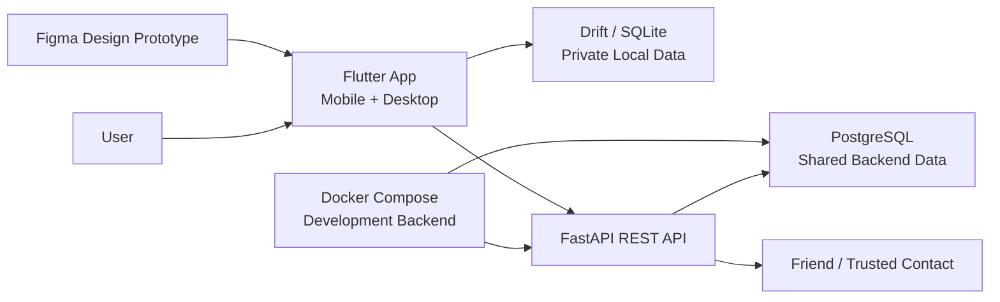

# Blocalm

## Project Plan / Software Development Plan

[Document structure consolidated from the RUP-style `Software_Development_Plan (1).docx` and `Projektplan (1).docx` reference documents.]

| Field | Value |
| --- | --- |
| Project | Blocalm |
| Document Type | Project Plan / Software Development Plan |
| Version | 0.1 |
| Date | 20.05.2026 |
| Prepared by | Project Team |
| Main Content Source | `doc/01_Requirements/Blocalm_Requirement_Specification.md` |
| Format References | `Software_Development_Plan (1).docx`, `Projektplan (1).docx` |
| Project Scope | Blocalm Version 1.0 cross-platform calendar, planner, and trusted scheduling application |

Blocalm is a local-first personal planning application that helps users organize calendar events, tasks, routines, reminders, and trusted availability. This project plan documents how the team intends to manage, implement, test, and deliver Blocalm from a software engineering perspective.

## Change History

| Date | Version | Change | Author(s) |
| --- | --- | --- | --- |
| 20.05.2026 | 0.1 | Initial consolidated Markdown project plan created from the two project-plan reference documents and the Blocalm Software Requirements Specification. | Project Team |

## Table of Contents

1. [Introduction](#1-introduction)
2. [Project Overview](#2-project-overview)
3. [Project Organization](#3-project-organization)
4. [Management Processes](#4-management-processes)
5. [Work Packages](#5-work-packages)
6. [Risk Management](#6-risk-management)
7. [Infrastructure](#7-infrastructure)
8. [Supporting Process Plans](#8-supporting-process-plans)
9. [Repository Reference](#9-repository-reference)
10. [Appendix A: Reference Comparison and Consolidation](#appendix-a-reference-comparison-and-consolidation)

## 1. Introduction

This section defines the purpose, scope, terminology, references, and structure of the project plan. The document is intended to support project coordination, implementation planning, quality assurance, and final project documentation.

### 1.1 Purpose

The purpose of this project plan is to describe how Blocalm Version 1.0 will be developed, managed, tested, and documented.

The document turns the requirements from the Blocalm Software Requirements Specification into an actionable software development plan. It defines the project organization, planned milestones, work packages, risks, development infrastructure, and supporting processes such as version control, issue management, quality management, and test management.

This project plan is not only an internal coordination document. It also represents the software engineering approach behind Blocalm and explains how the team plans to move from requirements to a working application.

### 1.2 Scope

This project plan covers Blocalm Version 1.0.

Version 1.0 focuses on:

- user registration and login
- personal calendar management
- day, week, month, and year calendar views
- calendar events, time blocks, recurring events, and reminders
- task creation and task status management
- event categories and basic custom categorization
- local-first storage of personal planning data
- privacy settings for event visibility
- trusted contacts and limited availability sharing
- schedule requests with accept, reject, and propose-another-time flows
- shared events created from accepted schedule requests
- in-app notifications
- basic user data export and account deletion support where feasible

The following features belong to future versions and are not part of the detailed Version 1.0 implementation scope:

- journaling
- guided journal prompts
- photo and voice-note journal attachments
- mood tracking
- mood statistics and color-wheel mood visualization
- avatar-based mood representation
- machine-learning-based mood pattern analysis

### 1.3 Definitions, Acronyms, and Abbreviations

| Term | Description |
| --- | --- |
| API | Application Programming Interface |
| Backend | Server-side service used for accounts, trusted contacts, shared availability, schedule requests, and synchronized notifications |
| Dart | Programming language used by Flutter applications |
| DB | Database |
| Docker Compose | Tool used to run the backend API and database together in a repeatable local development environment |
| Drift | Flutter/Dart persistence library for SQLite-based local storage |
| FastAPI | Python web framework planned for the backend REST API |
| Figma | Design and prototyping tool used for UI design and developer handoff |
| Flutter | Cross-platform UI framework planned for the Blocalm mobile and desktop frontend |
| GDPR | General Data Protection Regulation |
| GUI | Graphical User Interface |
| Local-first | Architecture where personal data is stored locally by default and synchronized only when needed for shared features |
| MVP | Minimum Viable Product |
| PostgreSQL | Relational database planned for backend/shared data |
| REST | Representational State Transfer; a possible API style for client-backend communication |
| SQLite | Local relational database used on the client for private planning data |
| SRS | Software Requirements Specification |
| V1.0 | First implemented Blocalm release described by this project plan |

### 1.4 References

- `doc/01_Requirements/Blocalm_Requirement_Specification.md`
- `doc/02_Prototype/Blocalm_dashboard.html`
- `doc/02_Prototype/README.md`
- `Software_Development_Plan (1).docx`
- `Projektplan (1).docx`
- Internal project discussions and agreed Blocalm Version 1.0 scope
- Planned technologies: Figma, Flutter, Dart, Drift/SQLite, FastAPI, PostgreSQL, REST API, and Docker Compose for backend development

### 1.5 Overview

The remaining sections define the Blocalm project overview, project organization, management process, milestones, release plan, work packages, risks, infrastructure, supporting process plans, and repository references. The appendix documents how the two reference documents were compared and consolidated.

## 2. Project Overview

This section summarizes the product vision, objectives, assumptions, constraints, deliverables, and future roadmap.

### 2.1 Product Vision

Blocalm is a calm, privacy-conscious planning application for users who want to structure their time without giving up control over personal data. The product combines a personal calendar, task planning, time blocking, reminders, and trusted scheduling with selected friends or contacts.

Version 1.0 is intentionally focused on the calendar and planner core. Future versions may expand Blocalm into journaling, mood tracking, and mood-intelligence features after the core planning system is stable.

### 2.2 Purpose and Objectives

The main project objective is to deliver a working cross-platform application that demonstrates a realistic software engineering process from requirements to implementation and testing.

The application objectives are:

- help users plan days, weeks, months, and years
- support events, tasks, routines, time blocks, categories, and reminders
- prevent or warn about double bookings
- keep personal planning data local whenever synchronization is not required
- support limited availability sharing with trusted contacts
- allow schedule requests and clear response states
- provide in-app notifications for reminders and shared scheduling updates
- document requirements, architecture, implementation, testing, and project decisions clearly

### 2.3 Version Scope

| Version | Theme | Scope |
| --- | --- | --- |
| Version 1.0 | Calendar, planner, and trusted scheduling | Flutter app for mobile and desktop targets, local calendar/task storage, reminders, privacy controls, trusted contacts, schedule requests, shared events, in-app notifications |
| Version 2.0 | Journaling | Daily entries, guided prompts, photo and voice-note attachments, search, and optional sharing |
| Version 3.0 | Mood tracking | Mood sliders, mood history, summaries, and color-wheel visualization |
| Version 4.0 | Mood intelligence | Pattern recognition, machine learning, avatar mood representation, and visual mood art |

### 2.4 Assumptions and Constraints

| Type | Description |
| --- | --- |
| Assumption | Users have basic mobile or desktop computer skills. |
| Assumption | The first implementation is developed and tested by a small project team. |
| Assumption | Version 1.0 can be tested with at least 5 active users or representative test accounts. |
| Assumption | Shared scheduling features require network access and backend synchronization. |
| Assumption | Backend development will use Docker Compose so the API and database can be started consistently by all developers. |
| Assumption | Free or open-source tools are preferred where possible. |
| Constraint | Version 1.0 shall be planned as a cross-platform application with mobile and desktop support. |
| Constraint | The app frontend should use Flutter and Dart. |
| Constraint | Figma is used for design and handoff, not as the production frontend runtime. |
| Constraint | The system shall prioritize local-first behavior for private planning data. |
| Constraint | Private calendar/task data should remain in local Drift/SQLite storage unless explicitly synchronized. |
| Constraint | The backend shall remain lightweight and focused on shared features. |
| Constraint | Backend/shared data shall be stored in PostgreSQL during development. |
| Constraint | Paid hosting is not required for the first development phase. |
| Constraint | Version 1.0 shall support English only. |
| Constraint | Journaling, mood tracking, and mood intelligence are out of scope for Version 1.0. |

### 2.5 Deliverables

| Deliverable | Description | Planned Evidence |
| --- | --- | --- |
| Software Requirements Specification | Defines functional and non-functional requirements for Blocalm Version 1.0. | `doc/01_Requirements/Blocalm_Requirement_Specification.md` |
| Project Plan / Software Development Plan | Describes development process, milestones, work packages, risks, infrastructure, and supporting processes. | This document |
| UI Prototype | Demonstrates the planned dashboard and main user interactions. | `doc/02_Prototype/Blocalm_dashboard.html` |
| Architecture Overview | Explains frontend, backend, database, and synchronization responsibilities. | Architecture section or separate architecture document |
| Source Code | Implements the Flutter app, local storage, backend integration, and shared scheduling features. | Repository source folders |
| Test Plan and Test Cases | Defines how requirements will be validated. | Test documentation and test results |
| User Manual | Explains how users operate Blocalm. | Final user documentation |
| Final Release Package | Working Version 1.0 application with documentation. | Tagged release or submitted package |

## 3. Project Organization

This section describes project roles, responsibilities, stakeholders, actors, and external interfaces.

### 3.1 Organizational Structure

Responsibilities are defined by role so the plan remains usable even if individual team assignments change during the project. Each role should still have one named owner in the team's issue tracker or meeting notes.

| Responsibility | Primary Role | Support |
| --- | --- | --- |
| Project Management | Project manager | Entire project team |
| Requirements Management | Requirements owner | Project manager |
| Architecture and Technical Design | Architecture owner | Frontend and backend developers |
| Flutter App Development | Frontend/client developer | UI/prototype support |
| Backend/API Development | Backend developer | Database/local storage support |
| Local Storage and Data Model | Data/storage developer | Backend/API support |
| Quality Management | Quality owner | Test manager |
| Test Management | Test manager | Developers responsible for each feature |
| Documentation | Documentation owner | Entire project team |
| Configuration and Version Control | Configuration manager | Project manager |

### 3.2 Stakeholders

| Stakeholder | Interest |
| --- | --- |
| Project Team | Wants to develop a realistic, working software project with clear documentation and traceability. |
| Student Developers | Need a manageable technical scope using accessible tools and clear work packages. |
| End Users | Want an easy-to-use, reliable, and visually clear planning application. |
| Friends / Trusted Contacts | Want to coordinate time without seeing private calendar details. |
| Future Users | May later benefit from journaling and mood-tracking extensions. |
| Administrator | May manage accounts and system-level data if required. |

### 3.3 Actors

| Actor | Description |
| --- | --- |
| User | Main user who creates events, tasks, routines, time blocks, reminders, and privacy settings. |
| Friend / Trusted Contact | Connected user who can view limited availability and participate in schedule requests. |
| Administrator | Optional actor who manages accounts or system-level information if the implementation includes administration features. |
| System | Handles validation, reminders, notifications, synchronization, and double-booking checks. |

### 3.4 External Interfaces

| Interface | Description |
| --- | --- |
| Flutter User Interface | Main mobile and desktop interface for calendar views, tasks, reminders, requests, friends, notifications, and settings. |
| Backend API | FastAPI REST service for registration, login, trusted contacts, availability, schedule requests, shared events, and synchronized notifications. |
| Backend Database | PostgreSQL database for accounts, friend connections, shared availability, schedule requests, shared events, and synchronized notifications. |
| Local Storage | Drift/SQLite local database for private personal events, tasks, categories, reminders, and privacy settings. |
| Notification Interface | In-app notification system for reminders, schedule requests, accepted requests, declined requests, and changed requests. |
| Repository | Git-based project storage for source code, documentation, prototype, and project artifacts. |

## 4. Management Processes

This section defines project estimates, phases, milestones, iterations, meetings, release planning, and change handling.

### 4.1 Project Estimates

The project is designed as a student software engineering project with a realistic but controlled scope. Version 1.0 should prioritize a complete and demonstrable core over a broad but unfinished feature set.

| Area | Estimated Complexity | Notes |
| --- | --- | --- |
| Requirements and documentation | Medium | SRS already exists; traceability and project planning must be maintained. |
| Flutter cross-platform UI | High | Calendar views, forms, task panels, and request flows require careful interaction design across mobile and desktop layouts. |
| Local storage | Medium | Events, tasks, categories, reminders, and privacy settings must persist reliably. |
| Backend/API | Medium to high | FastAPI authentication and shared scheduling require secure and consistent behavior. |
| Backend database | Medium | PostgreSQL schema, migrations, and seed data must support repeatable development. |
| Trusted scheduling | High | Availability sharing, schedule requests, counterproposals, and shared events introduce state complexity. |
| Notifications | Medium | In-app notifications are required; email is optional. |
| Testing and quality assurance | Medium | Requirements are testable and should be covered through focused test cases. |
| Deployment/release packaging | Medium | Mobile/desktop app builds and Docker Compose backend setup must be documented. |

### 4.2 Project Plan

The project follows an iterative process. Requirements and architecture are defined first, then the project moves through prototype, implementation, integration, stabilization, and final documentation.

#### 4.2.1 Phase Plan

| Phase | Objective | Main Activities | Main Deliverables |
| --- | --- | --- | --- |
| Phase 1: Requirements and Planning | Establish project scope and planning baseline. | Finalize SRS, create project plan, define milestones and work packages. | SRS, project plan, initial issue list |
| Phase 2: Architecture and Prototype | Define technical structure and validate main user flows. | Define Flutter/backend responsibilities, design local and backend data models, review UI prototype, define REST API and Docker Compose setup. | Architecture overview, prototype review notes, local storage model, backend schema draft |
| Phase 3: Core App Implementation | Implement local calendar and planner functionality. | Build Flutter app shell, responsive calendar views, event forms, task management, categories, reminders, Drift/SQLite persistence. | Working local planner prototype |
| Phase 4: Backend and Shared Scheduling | Implement account and trusted scheduling features. | Add FastAPI registration/login, PostgreSQL schema, friend connections, availability, schedule requests, response states, shared event creation. | Integrated Flutter-backend prototype |
| Phase 5: Quality and Stabilization | Verify requirements and improve reliability. | Run tests, fix defects, validate privacy behavior, improve usability, document known limitations. | Test results, fixed issues, release candidate |
| Phase 6: Final Release and Documentation | Package and present the final project. | Finalize user manual, architecture notes, test documentation, final project plan updates. | Blocalm Version 1.0 release package and documentation |

#### 4.2.2 Milestones

Exact calendar deadlines should be confirmed against the course or project submission schedule. The milestone sequence below defines the recommended control points.

| Milestone | Description | Main Deliverables | Exit Criteria | Target Window |
| --- | --- | --- | --- | --- |
| MS0 | Project scope baseline | SRS v0.2, consolidated project plan draft | Version 1.0 scope is clear and future features are separated. | Current |
| MS1 | Requirements and project planning complete | Finalized SRS, project plan, work package list | Requirements are reviewable, prioritized, and traceable. | Week 1 |
| MS2 | Architecture and data model baseline | Architecture overview, Drift/SQLite local model, PostgreSQL backend model, API outline, Docker Compose setup | App, backend, and storage responsibilities are agreed. | Week 2 |
| MS3 | UI and local planner prototype | Flutter shell, responsive calendar view, event/task forms | User can create and view local events and tasks. | Week 3 |
| MS4 | Core calendar MVP | Calendar CRUD, time blocks, reminders, categories, persistence | Must-have local planning requirements are implemented and tested. | Week 4 |
| MS5 | Shared scheduling integration | Authentication, trusted contacts, schedule requests, shared events | Main shared scheduling flow works with test users. | Week 5 |
| MS6 | Beta and test pass | Requirement-based tests, defect fixes, usability review | Major defects are documented or fixed; privacy behavior is verified. | Week 6 |
| MS7 | Final release and documentation | Release package, user manual, final project documentation | Application and documentation are ready for submission/presentation. | Final week |

#### 4.2.3 Iteration Objectives

| Iteration | Objective | Included Requirements |
| --- | --- | --- |
| Iteration 1: Planning Foundation | Finalize project scope, work packages, repository structure, and architecture decisions. | SRS traceability, project plan, architecture overview |
| Iteration 2: Local Planner Core | Implement local calendar events, tasks, time blocks, categories, reminders, and persistence. | FR-V1-004 to FR-V1-014, FR-V1-022, FR-V1-024 |
| Iteration 3: Accounts and Trusted Scheduling | Implement login/registration, friends, availability, schedule requests, responses, counterproposals, and shared events. | FR-V1-001, FR-V1-002, FR-V1-015 to FR-V1-020, FR-V1-023 |
| Iteration 4: Quality, Privacy, and Release | Stabilize, test, document, and package the final version. | NFRs, FR-V1-025, FR-V1-026, final documentation |

#### 4.2.4 Meetings

| Meeting | Frequency | Purpose | Expected Output |
| --- | --- | --- | --- |
| Project Planning Meeting | Once at the start of each phase | Confirm phase goals, responsibilities, and next deliverables. | Updated tasks and responsibilities |
| Weekly Status Meeting | Weekly | Review progress, blockers, risks, and upcoming work. | Updated issue board and risk list |
| Technical Sync | As needed | Align architecture, data model, API contracts, and implementation decisions. | Decision notes |
| Review Meeting | At each milestone | Check deliverables against milestone exit criteria. | Acceptance notes and follow-up tasks |
| Final Retrospective | End of project | Reflect on process, quality, and future improvements. | Lessons learned |

#### 4.2.5 Releases

| Release | Description | Main Contents | Planned Status |
| --- | --- | --- | --- |
| Prototype/Alpha | First working demonstration of the main interface and local planning flow. | Calendar UI, event creation, task panel, prototype data. | Planned |
| Beta | Integrated feature version for testing. | Local planner, persistence, reminders, authentication, trusted scheduling basics. | Planned |
| Release Candidate | Stabilized version for final validation. | Feature-complete Version 1.0 with known defects documented. | Planned |
| Version 1.0 | Final submitted release. | Working Flutter application, Docker Compose backend, source code, tests, and documentation. | Planned |

##### Client Release Scope

The client release includes the Flutter application for selected mobile and desktop targets, calendar views, event and task forms, Drift/SQLite local storage integration, reminders, privacy controls, friends/request screens, notifications, and settings.

##### Backend Release Scope

The backend release includes the FastAPI REST API, PostgreSQL data model, registration, login, trusted contacts, limited availability, schedule request state handling, shared event synchronization, and synchronized notification support. During development, the backend and database should run through Docker Compose.

#### 4.2.6 Change Control

Because Blocalm has a larger long-term vision than Version 1.0, change control is important. New feature ideas should be classified as one of the following:

| Classification | Meaning | Action |
| --- | --- | --- |
| Version 1.0 required | Needed to satisfy a must-have requirement. | Add to the active issue list and plan into the current milestone. |
| Version 1.0 optional | Useful but not essential for the release. | Add only if milestone risk remains low. |
| Future version | Belongs to journaling, mood tracking, or mood intelligence. | Record in future scope and do not implement before Version 1.0 is stable. |
| Out of scope | Not aligned with Blocalm objectives. | Reject or archive with a short reason. |

## 5. Work Packages

This section divides the project into manageable work packages. Each work package should be represented by issues or tasks in the project management system.

| ID | Work Package | Scope | Main Requirements / References | Deliverables |
| --- | --- | --- | --- | --- |
| WP1 | Project Management and Planning | Coordinate milestones, responsibilities, meetings, and risk tracking. | Project plan, milestones, risk register | Updated plan, meeting notes, issue board |
| WP2 | Requirements and Traceability | Maintain SRS, requirement priorities, use cases, and traceability. | SRS sections 3 to 6 | Traceability matrix, reviewed requirements |
| WP3 | Architecture and Technical Design | Define Flutter app, backend, local storage, API, Docker Compose, and synchronization responsibilities. | SRS 2.1, 4.8 | Architecture overview, API outline, local and backend data models |
| WP4 | Flutter App UI Foundation | Create Flutter app shell, responsive navigation, dashboard layout, and common UI patterns. | NFR-V1-001 to NFR-V1-004 | Running Flutter application shell |
| WP5 | Calendar and Event Management | Implement event create/edit/delete, calendar views, categories, visibility, and conflict handling. | FR-V1-004 to FR-V1-008, FR-V1-013, FR-V1-022, FR-V1-024 | Local calendar feature set |
| WP6 | Tasks, Recurrence, and Reminders | Implement task CRUD/status, recurring events, reminders, and in-app reminder notifications. | FR-V1-009 to FR-V1-012, FR-V1-023 | Planner and reminder feature set |
| WP7 | Local Storage and Persistence | Store private events, tasks, categories, reminders, privacy settings, and local account-related state in Drift/SQLite. | NFR-V1-005, NFR-V1-006, local-first constraints | Local database/storage layer |
| WP8 | Backend API, Database, and Authentication | Implement FastAPI registration, login, password handling, PostgreSQL models, API endpoints, migrations, and Docker Compose setup. | FR-V1-001, FR-V1-002, NFR-V1-013, NFR-V1-016 | Backend service, database schema, Docker Compose setup, and API documentation |
| WP9 | Trusted Contacts and Shared Scheduling | Implement friends, availability, schedule requests, responses, counterproposals, and shared events. | FR-V1-015 to FR-V1-020 | Shared scheduling feature set |
| WP10 | Privacy, Security, and Data Control | Enforce private event protection, limited synchronization, data export, and account deletion. | FR-V1-024 to FR-V1-026, NFR-V1-011 to NFR-V1-014 | Privacy controls and data handling notes |
| WP11 | Testing and Quality Assurance | Create and execute tests against requirements and use cases. | All must-have and should-have requirements | Test plan, test cases, defect list |
| WP12 | User and Technical Documentation | Produce final user manual, setup instructions, architecture notes, and release notes. | Deliverables section | Final documentation package |

### 5.1 Requirement Priority Focus

The team should complete must-have requirements before optional features.

| Priority | Implementation Rule |
| --- | --- |
| Must Have | Required for Version 1.0 and should be planned before beta. |
| Should Have | Important for a complete product, but may be reduced if schedule risk becomes high. |
| Could Have | Optional; implement only after must-have and critical should-have items are stable. |

### 5.2 Version 1.0 Requirement Summary

| Category | Included Items |
| --- | --- |
| Account | Registration, login, basic profile support if time permits |
| Calendar | Events, editing, deletion, day/week/month/year views, categories |
| Planner | Tasks, task status, time blocks, recurrence, reminders |
| Privacy | Event visibility, private event protection, limited synchronization |
| Social Scheduling | Trusted contacts, availability, schedule requests, responses, alternative proposals, shared events |
| Notifications | In-app reminders, request notifications, shared scheduling updates |
| Data Control | Export user data and delete account/data where feasible |

## 6. Risk Management

This section identifies project risks and countermeasures.

| Risk | Impact | Probability | Countermeasure |
| --- | --- | --- | --- |
| Scope creep from future mood and journaling features | High | Medium | Keep Version 1.0 focused on calendar, planner, and trusted scheduling. Move mood/journal ideas to the future roadmap. |
| Flutter cross-platform layout becomes too broad | Medium | Medium | Start with one primary mobile layout and one desktop/tablet layout, then reuse components where practical. |
| Docker Compose backend setup slows teammates | Medium | Medium | Keep `docker compose up` as the standard backend start path and document required environment variables. |
| Backend database schema changes break development data | Medium | Medium | Use migrations and seed data. Keep disposable development volumes acceptable during early implementation. |
| Shared scheduling state becomes too complex | High | Medium | Define simple request states: pending, accepted, declined, changed/counterproposal. Test state transitions early. |
| Local-first and backend synchronization boundaries are unclear | High | Medium | Document which data stays local and which data is synchronized. Review privacy behavior before beta. |
| Backend unavailable during testing | Medium | Medium | Keep local planning features usable offline and provide clear unavailable/sync-pending states. |
| Data persistence bugs cause lost events or tasks | High | Low to medium | Add persistence tests and manual restart tests for events, tasks, categories, reminders, and privacy settings. |
| Double-booking logic misses conflicts | Medium | Medium | Test overlapping events, time blocks, recurring events, and accepted shared requests. |
| Password or account handling is insecure | High | Low to medium | Never store plain text passwords. Use secure password hashing in the backend. |
| UI becomes visually unclear or too crowded | Medium | Medium | Use the prototype as a reference and run usability checks on calendar, task, and request flows. |
| Testing starts too late | High | Medium | Create test cases with each feature and run milestone-level validation. |
| Team responsibilities are unclear | Medium | Medium | Assign owners for each work package and update the issue board after each meeting. |
| Final documentation is rushed | Medium | Medium | Update documentation during each phase instead of writing everything at the end. |

## 7. Infrastructure

This section defines the development environment, architecture, tools, and repository structure.

### 7.1 Development Environment

| Area | Planned Tool / Technology | Purpose |
| --- | --- | --- |
| Design/prototype | Figma | Design screens, user flows, and developer handoff assets. |
| App frontend | Flutter | Build the cross-platform mobile and desktop application. |
| Programming language | Dart | Implement Flutter app logic and UI. |
| Local app storage | Drift with SQLite | Store private calendar, task, reminder, category, and privacy data locally. |
| Backend API | FastAPI | Handle accounts, trusted contacts, shared availability, schedule requests, and synchronized notifications. |
| Backend database | PostgreSQL | Store backend/shared data such as users, friend connections, schedule requests, shared events, and synced notifications. |
| API style | REST API or equivalent lightweight API | Connect the Flutter app to backend services. |
| Development setup | Docker Compose | Run the backend API and PostgreSQL database consistently for all developers. |
| Documentation | Markdown | Keep project documentation readable and version controlled. |
| Version control | Git | Track source code, documentation, and project changes. |

### 7.2 Architecture Overview

Blocalm Version 1.0 separates local personal planning from shared scheduling.

The Flutter app is responsible for the main user interface, local calendar behavior, local task management, reminders, privacy controls, and offline usability. Private planning data is stored locally with Drift/SQLite. The backend is responsible only for shared features such as account handling, trusted contacts, availability sharing, schedule requests, shared events, and synchronized notifications. During development, Docker Compose runs the FastAPI service and PostgreSQL database together.

### 7.3 Local-First Data Boundary

| Data Type | Default Location | Synchronization Rule |
| --- | --- | --- |
| Private events | Local storage | Not synchronized unless explicitly shared or needed as busy/free status according to privacy settings. |
| Tasks | Local storage | Not synchronized in Version 1.0 unless a later decision requires it. |
| Time blocks | Local storage | Used for local planning and conflict checks. |
| Categories | Local storage | Stored locally. |
| Reminders | Local storage | Triggered in-app where supported. |
| Account data | Backend | Required for login and shared scheduling. |
| Trusted contacts | Backend | Required for friend connections. |
| Availability | Backend, limited form | Only limited free/busy or allowed availability data should be synchronized. |
| Schedule requests | Backend | Required for sender/recipient coordination. |
| Shared events | Backend and local client | Synchronized only for accepted participants. |

### 7.4 Further Tools

| Tool | Purpose |
| --- | --- |
| VS Code or Android Studio | Flutter, Dart, and backend code editing and development. |
| Figma | UI design, clickable prototypes, and design handoff. |
| Browser | Open and review the HTML prototype. |
| Docker Desktop or Docker Engine | Run Docker Compose backend services. |
| GitHub, GitLab, or equivalent | Remote repository and issue tracking if used by the team. |
| Diagram tool or Mermaid | Architecture, use case, and workflow diagrams. |
| Markdown previewer | Review project documentation before submission. |

## 8. Supporting Process Plans

This section defines the supporting processes needed to keep the project controlled and reviewable.

### 8.1 Version Control

The project should use Git for all source code and documentation.

Recommended rules:

- Keep work on feature branches where possible.
- Use clear commit messages that describe the change.
- Do not mix unrelated changes in one commit.
- Review changes before merging into the main branch.
- Tag the final submitted release.

Suggested branch types:

| Branch Type | Example | Purpose |
| --- | --- | --- |
| Main branch | `main` | Stable project baseline. |
| Feature branch | `feature/calendar-events` | New feature implementation. |
| Fix branch | `fix/reminder-validation` | Defect correction. |
| Documentation branch | `docs/project-plan` | Documentation updates. |

### 8.2 Issue Management

The team should track implementation work with issues or tasks. Each issue should have:

- title
- description
- related requirement ID where applicable
- priority
- owner
- status
- acceptance criteria

Recommended issue statuses:

| Status | Meaning |
| --- | --- |
| Backlog | Task is known but not scheduled. |
| Ready | Task is clarified and can be started. |
| In Progress | Task is actively being worked on. |
| Review | Task is implemented and awaiting review/testing. |
| Done | Task is accepted and documented if needed. |

### 8.3 Quality Management

Quality management should focus on correctness, usability, privacy, and maintainability.

Quality criteria:

- Requirements are traceable to implementation and tests.
- Must-have requirements are implemented before optional features.
- Local data persists after restart.
- Private calendar details are not exposed to friends.
- Shared scheduling flows have clear visible states.
- Error messages are understandable.
- Code is structured so team members can maintain it.
- Documentation stays aligned with the implemented system.

### 8.4 Test Management

Testing should be based on the SRS requirement IDs and use case IDs.

Recommended test areas:

| Test Area | Example Test Focus |
| --- | --- |
| Account tests | Registration, login, invalid credentials, password handling. |
| Calendar tests | Create, edit, delete, view switching, invalid times, categories. |
| Task tests | Create, edit, delete, status changes, persistence. |
| Reminder tests | Reminder creation, in-app display, dismiss behavior. |
| Conflict tests | Overlapping events, time blocks, and shared accepted events. |
| Privacy tests | Private events hidden from friends, limited busy/free visibility. |
| Shared scheduling tests | Friend connection, request sending, accept, decline, counterproposal. |
| Offline tests | Local features usable without backend access. |
| Persistence tests | Data remains available after application restart. |
| Usability tests | Main flows can be completed without confusion. |

### 8.5 Backup

Project backup should rely on a remote Git repository if available. Important documentation and source code should not exist only on one developer machine.

Recommended backup rules:

- Push important work regularly.
- Keep project documentation in the repository.
- Avoid storing private credentials in the repository.
- Keep local database test data separate from real user data.

### 8.6 Documentation Guidelines

Documentation should be written in clear English and kept close to the project artifacts it describes.

Recommended documentation rules:

- Use Markdown for repository documentation.
- Keep headings numbered for major formal documents.
- Use tables for responsibilities, milestones, requirements, risks, and deliverables.
- Reference requirement IDs when describing implementation or tests.
- Separate Version 1.0 scope from future features.
- Update documentation when implementation decisions change.

### 8.7 Time Tracking

The team should record enough time information to understand progress and effort distribution.

Suggested time categories:

| Category | Examples |
| --- | --- |
| Requirements | SRS updates, use case review, traceability. |
| Design | Architecture, UI decisions, data model, API design. |
| Implementation | Flutter app, FastAPI backend, Drift/SQLite local storage, PostgreSQL backend storage, scheduling logic. |
| Testing | Test cases, manual tests, defect reproduction. |
| Documentation | Project plan, user manual, release notes. |
| Meetings | Planning, technical sync, milestone review. |

## 9. Repository Reference

The current repository contains the following relevant project artifacts:

| Path | Purpose |
| --- | --- |
| `README.md` | Short repository description. |
| `doc/01_Requirements/Blocalm_Requirement_Specification.md` | Main SRS and requirements source for this project plan. |
| `doc/02_Prototype/README.md` | Prototype explanation and UI mapping to requirements. |
| `doc/02_Prototype/Blocalm_dashboard.html` | HTML prototype for the Blocalm dashboard. |
| `doc/03_Project_Plan/Blocalm_Project_Plan.md` | This consolidated project plan / software development plan. |

## Appendix A: Reference Comparison and Consolidation

The two Word documents were used as format and structure references, not as final project content. Both documents describe the same RUP-style software development plan pattern and contain similar sections, but they differ in language and completeness.

### A.1 Reference Comparison

| Area | `Software_Development_Plan (1).docx` | `Projektplan (1).docx` | Consolidation Decision |
| --- | --- | --- | --- |
| Language | Mostly English | German with English labels in several headings | Use English for the Blocalm Markdown document, while keeping the project-plan meaning of `Projektplan`. |
| Main title | Software Development Plan | Projektplan / Software Development Plan | Use `Project Plan / Software Development Plan`. |
| Structure | RUP-style structure with Introduction, Project Overview, Project Organization, Management Processes, Work Packages, Risk Management, Infrastructure, Supporting Process Plans, Repository Reference | Same overall structure | Keep the shared RUP-style structure. |
| Change history | More entries | Fewer entries | Use a clean Blocalm-specific change history. |
| Table of contents | Includes table of contents and list of figures | Includes table of contents | Use Markdown table of contents; omit list of figures until the project has formal figures beyond Mermaid diagrams. |
| Release section | Has more detailed release breakdown, including client/server subsections | Has a simpler release section | Keep release table and separate client/backend release scope. |
| Risks | Larger risk set | Smaller risk set | Use a Blocalm-specific risk register with local-first, synchronization, privacy, Flutter, Docker/backend setup, testing, and scope risks. |
| Infrastructure | More detailed tool tables | Similar but shorter tool tables | Use infrastructure tables tailored to Blocalm technologies. |
| Work packages | Generic project work package section | Generic project work package section | Replace sample content with Blocalm work packages mapped to SRS requirements. |

### A.2 Combined Structure Used for Blocalm

The final structure combines the strongest parts of both references:

1. Front matter with title, metadata, change history, and table of contents.
2. Introduction with purpose, scope, definitions, references, and overview.
3. Project overview with objectives, assumptions, constraints, deliverables, and version scope.
4. Project organization with roles, stakeholders, actors, and external interfaces.
5. Management processes with estimates, phases, milestones, iterations, meetings, releases, and change control.
6. Work packages mapped to Blocalm requirements.
7. Risk management tailored to the actual project.
8. Infrastructure and local-first architecture.
9. Supporting process plans for version control, issue management, quality, testing, backup, documentation, and time tracking.
10. Repository reference and comparison appendix.

### A.3 Scope Decision

The reference documents include sample content for a different project. That sample content was not copied into the Blocalm plan. Only the format, section structure, and planning pattern were reused.

The Blocalm-specific content comes from the Software Requirements Specification and the current repository prototype documentation. This keeps the project plan aligned with the actual application and avoids mixing Blocalm with the previous sample project.
